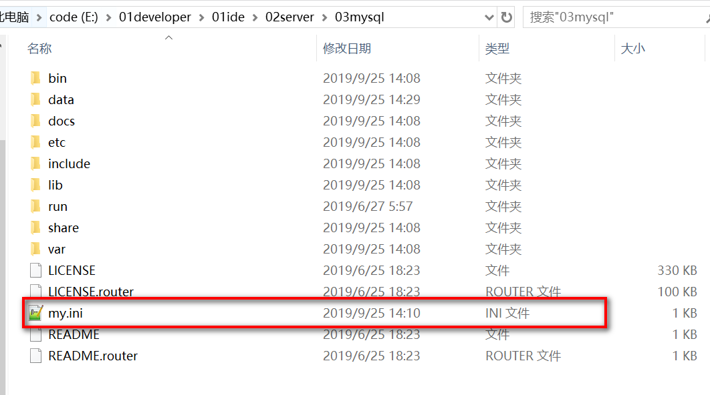

### 一,下载mysql纯洁安装包

（1）点击  [官网地址](https://dev.mysql.com/downloads/mysql/) 下载安装软件

​        


（2)点击下载后会跳到下一个页面


（3）解压安装包到自己的安装目录，我的安装目录是  E:\01developer\01ide\02server\03mysql


（4）创建【my.ini】文件，并且添加以下代码

```
[mysqld]
port = 3306
basedir=E:/01developer/01ide/02server/03mysql
datadir=E:/01developer/01ide/02server/03mysql/data 
max_connections=200
character-set-server=utf8
default-storage-engine=INNODB
sql_mode=NO_ENGINE_SUBSTITUTION,STRICT_TRANS_TABLES
[mysql]
default-character-set=utf8

```

basedir:是我mysql安装目录

datadir：是放置数据库的地方

（5）把【my.ini】文件移动到mysql安装目录。（E:\01developer\01ide\02server\03mysql）



### 二，环境变量设置

（1）找到环境变量打开位置


（2）添加环境系统变量   MYSQL_HOME


（3）编辑path变量，添加MYSQL_HOME


### 三，安装mysql

（1）找到管理员cmd命令，在C:\Windows找到 cmd.exe文件，点击右键以管理员身份打开


（2）执行mysqld -install命令进行安装


（3）执行mysqld --initialize-insecure --user=mysql命令初始化


（4）成功后，会生成data目录并生成root用户


（5）执行net start mysql命令启动MySQL


（6）启动成功，执行"mysqladmin -u root -p password 新密码"命令设置密码，root旧密码为空，直接回车就可以。


### 四，确认服务器的用户名和密码

（1）在控制台进入mysql命令行

​         输入以下代码         

```
mysql -uroot -p
```

（2）查询所有的用户

select host,user,plugin,authentication_string from mysql.user;


备注：host为 % 表示不限制ip    localhost表示本机使用    plugin非mysql_native_password 则需要修改密码

（3）修改用户密码

ALTER USER 'root'@'%' IDENTIFIED WITH mysql_native_password BY '123456';
更新user为root，host为% 的密码为123456

ALTER USER 'root'@'localhost' IDENTIFIED WITH mysql_native_password BY '123456';
更新user为root，host为localhost 的密码为123456


