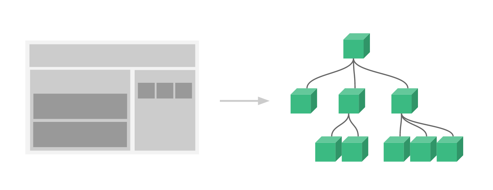

# Vue.js是什么 尤雨溪

- Vue.js（读音 /vjuː/, 类似于 **view**）是目前最火的一个框架，React是最流行的一个框架（React除了开发网站，还可以开发手机App）。

- Vue.js是前端的**主流框架之一**，和Angular.js、React.js并称为前端三大主流框架。

- Vue.js 是一套构建用户界面的 **渐进式框架**。与其他重量级框架不同的是，Vue 采用自底向上增量开发的设计。

- Vue 的核心库只关注**视图层**，并且非常容易学习，非常容易与其它库或已有项目整合。另一方面，Vue 完全有能力驱动采用[单文件组件](http://doc.vue-js.com/v2/guide/single-file-components.html)和[Vue生态系统支持的库](http://github.com/vuejs/awesome-vue#libraries--plugins)开发的复杂单页应用。

- Vue.js 的目标是通过尽可能简单的 API 实现**响应的数据绑定**和**组合的视图组件**。


# 为什么要学习流行框架

- 企业为了提高开发效率：在企业中，时间就是效率，效率就是金钱。
- 提高开发效率的发展历程：原生JS(需要兼容浏览器) -> JQuery之类的类库 ->前端模板引擎（频繁操作DOM元素） -> Angular.js / Vue.js（减少不必要的DOM操作，提高渲染效率，双向数据绑定：使用指令，这样程序员只需要关心数据的业务逻辑，不再关心DOM如何渲染）。
- 在Vue中一个核心的概念，就是让用户不再操作DOM元素，解放了用户的双手，让程序员可以更多的时间去关注业务逻辑。
- 增强自己就业时的竞争力


# 框架和库的区别

- **框架**：是一套完整的解决方案，对项目的入侵性较大，项目如果需要更换框架，则需要重新架构整个项目
- **库（插件）**：提供某一个小功能，对项目的入侵性较小，如果某个库无法完成某些需求，可以很容易的切换到其他库来实现。


# Node（后端）中的MVC与前端的MVVM之间的区别

### （1）MVC

- **M（Model）：数据模型层**。是应用程序中用于**处理应用程序数据逻辑**的部分，模型对象负责在数据库中存取数据。  
- **V（View）：视图层**。是应用程序中**处理数据显示**的部分，视图是依据模型数据创建的。 
- **C（Controller）：控制层**。是应用程序中**处理用户交互**的部分，控制器负责从视图读取数据，控制用户输入，并向模型发送数据。 


- **Client** - 客户端，一般指浏览器，浏览器可以通过 HTTP 协议向服务器请求数据。
- **Server** - 服务端，一般指 Web 服务器，可以接收客户端请求，并向客户端发送响应数据。
- **Business** - 业务层， 通过 Web 服务器处理应用程序，如与数据库交互，逻辑运算，调用外部程序等。
- **Data** - 数据层，一般由数据库组成。


### （2）MVVM

- **M（Model）：模型层**。就是业务逻辑相关的数据对象，通常从数据库映射而来，我们可以说是与数据库对应的model。 
- **V（View）：视图层。**就是展现出来的用户界面。 
- **VM（ViewModel）：视图模型层。**就是与界面(view)对应的Model。因为，数据库结构往往是不能直接跟界面控件一一对应上的，所以，需要再定义一个数据对象专门对应view上的控件。而ViewModel的职责就是把model对象封装成可以显示和接受输入的界面数据对象。 


View与ViewModel之间通过双向绑定（data-binding）建立联系，这样当View（视图层）变化时，会自动更新到ViewModel（视图模型），反之亦然。


# Vue.js有什么不同？

如果我们使用JQuery在指定的DOM中插入一个元素，并给它绑定一个点击事件：

~~~html
<div id="app"></div>
<script src="./js/jquery.js"></script>
<script>
	var btn = $('<button>Click Me</button>');
	btn.on('click', function() {
		console.log("hello");
	});
	$('#app').append(btn);
</script>
~~~

这个代码操作的内容并不复杂，不过这样写就会让我们的视图代码与业务逻辑代码紧密耦合在一起，随着功能不断增加，直接操作DOM会使得代码越来越难以维护。

而Vue.js通过MVVM的模式拆分为视图和数据两部分，并将其分离，我们只需要关心数据就可以，DOM操作则有Vue搞定。

~~~html
<body>
	<div id="app">
		<button v-if='showBtn' v-on:click='handleClick'>Click Me</button>
	</div>
		
	<script src="https://unpkg.com/vue/dist/vue.js"></script>		
</body>
<script type="text/javascript">
	new Vue({
		el: '#app',
		data: {
			showBtn: true
		},
		methods: {
			handleClick: function() {
				console.log("clicked");
			}
		}
	});
</script>
~~~


# Vue.js安装

#### 1、独立版本

我们可以在 Vue.js 的官网上直接下载 **vue.js** 并用 **<script>** 标签引入。 

下载地址： https://vuejs.org/js/vue.min.js


#### 2、使用CDN方法

以下推荐国外比较稳定的两个 CDN，国内还没发现哪一家比较好，目前还是建议下载到本地。 

- **BootCDN（国内）** : <https://cdn.bootcss.com/vue/2.2.2/vue.min.js>
- **unpkg**：<https://unpkg.com/vue/dist/vue.js>, 会保持和 npm 发布的最新的版本一致。
- **cdnjs** : <https://cdnjs.cloudflare.com/ajax/libs/vue/2.1.8/vue.min.js>


##### （1）在桌面建立一个 Vue.html文件, 并添加HTML页面的架构，然后引入 vue.js的CDN地址  

~~~html
<script src="https://unpkg.com/vue/dist/vue.js"></script>
~~~

##### （2）在Vue.html文件中插入一个id为firstVue的div标签

~~~html
<div id="firstVue"></div>
~~~

##### （3）在Vue.html文件中插入如下js代码

~~~html
<script>
	new Vue({
		el: "#firstVue",
	})
</script>
~~~

完整代码如下：

~~~html
<!DOCTYPE html>
<html>
	<head>
		<title>Vue Demo</title>
		<script src="https://unpkg.com/vue/dist/vue.js"></script>
	</head>
	<body>
		<div id="firstVue"></div>
	<body>
	<script>
		new Vue({
			el: "#firstVue",
		})
	</script>
</html>
~~~

 **new  Vue({})**就是Vue创建的一个对象，可以理解成把`<div id="firstVue></div>`和这个标签里面包含的所有DOM都实例化成了一个JS对象 。

**el**是Vue的保留字，用来指定实例化的**DOM的id号**, **#firstVue**这句话就是id选择器，告诉Vue要实例化`id="firstVue"`的这个标签。 


##### （4）在创建 vue实例的代码中加入下面数据声明: 

~~~javascript
data: {
	my_data: "hello world"
}
~~~

##### （5）在标签中通过**{{}}**来引用变量值：

~~~html
<div id="firstVue">{{my_data}}</div>
~~~

双大括号的语法叫做**mustach** 语法，大括号里面的是作为变量形式出现的。 

完整代码如下：

~~~html
<!DOCTYPE html>
<html>
	<head>
		<title>Vue Demo</title>
		<script src="https://unpkg.com/vue/dist/vue.js"></script>
	</head>
	<body>
		<div id="firstVue">{{my_data}}</div>
	<body>
	<script>
		new Vue({
			el: "#firstVue",
			data: {
				my_data: "hello world"
			}
		})
	</script>
</html>
~~~

**data**参数用来绑定VUE实例的数据变量，每个不同变量之间用逗号分隔，上面我们绑定了自定义变量`my_data`，并赋初值"hello world"。

完成数据绑定工作，`<div>`标签里的  **{{myData}}**  数据会随着myVue实例里的`my_Data`数据的变动而变动，浏览器查看当前页面,会出现"hello world"字符串，说明数据绑定成功。

 **VUE这个框架的数据流向是单向的**，数据绑定后的数据流向是从**vue实例**——>**DOM文档**。

 

 

#### 3、NPM方法

##### （1）国内使用npm速度较慢，使用淘宝定制的cnpm（gzip压缩支持）命令行工具代替默认的npm：

~~~
$ npm install -g cnpm --registry=https://registry.npm.taobao.org
$ npm config set registry https://registry.npm.taobao.org
~~~

##### （2）npm 版本需要大于 3.0，如果低于此版本需要升级它： 

~~~shell
# 查看版本
$ npm -v
5.6.0

#升级 npm
$ cnpm install npm -g
~~~

##### （3）在用 Vue.js 构建大型应用时推荐使用 NPM 安装： 

~~~shell
# 最新稳定版
$ cnpm install vue -g
~~~

##### （4）创建项目并安装运行

Vue.js 提供一个官方命令行工具，可用于**快速搭建大型单页应用**。 

~~~shell
# 全局安装 vue-cli
$ cnpm install --global vue-cli

# 创建一个基于 webpack 模板的新项目
$ vue init webpack my-project

# 这里需要进行一些配置，默认回车即可
? Project name  my-project
? Project description  A Vue.js project
? Author  thd
? Vue build (Use arrow keys)
? Vue build   standalone
? Install vue-router?   Yes
? Use ESLint to lint your code?   Yes
? Pick an ESLint preset   Standard
? Set up unit tests   Yes
? Pick a test runner   jest
? Setup e2e tests with Nightwatch?   Yes

   vue-cli · Generated "my-project".
   
To get started:
  cd my-project
  npm run dev
 
#进入项目，安装并运行
  $ cd my-project
  $ cnpm run dev
  
~~~

成功执行以上命令后访问 http://localhost:8080/，输出结果如下所示： 


# Vue.js 目录结构

#### 1、项目目录


- **build**：项目构建(webpack)相关代码 ，用来保存webpack的初始化配置。
- **config**：配置目录，保存项目初始化配置，包括端口号等。我们初学可以使用默认的 。
- **node_modules**：npm 加载的项目依赖模块 
- **src**： 这里是我们要开发的目录，基本上要做的事情都在这个目录里。
  - **assets**：放置一些图片，如logo等。 
  - **components**：放置组件文件，可以不用。 
  - **router**：前端路由配置
  - **App.vue**：项目入口文件，可以直接将组件写这里，而不使用 components 目录。 
  - **main.js**：项目的核心文件。 
- **static**：静态资源目录，如图片、字体等。 
- **test**： 初始测试目录，可删除 
- **index.html**：首页入口文件，可以添加一些 meta 之类的信息。 
- **package.json**：项目配置文件
- **README.md**：项目的说明文档，Markdown格式。


#### 2、相关文件

##### （1）index.html

项目的**入口页面**，可以像普通的html文件一样引入文件和书写基本信息，添加meta标签等。

~~~html
<!DOCTYPE html>
<html>
  <head>
    <meta charset="utf-8">
    <meta name="viewport" content="width=device-width,initial-scale=1.0">
    <title>my-project</title>
  </head>
  <body>
    <div id="app"></div>
  </body>
</html>

~~~

##### （2）main.js

项目的**入口文件**，可以引入一些插件或静态资源，当然引入之前要先安装了该插件，在package.json文件中有记录。

~~~javascript
import Vue from 'vue'
import App from './App'
import router from './router'

//设置为 false 表示阻止启动生产消息，常用作指令。
Vue.config.productionTip = false

new Vue({
  el: '#app',
  router,
  components: { App },
  template: '<App/>'
})
/*
el: '#app' ---表示将所有的组件都放在id为app的元素中
router---配置路由，路由允许我们通过不同的 URL 访问不同的内容
components: { App }---表示引入的文件，此处就是App.vue这个文件，也就是组件
template: '<App/>'---模板将会替换挂载的元素。挂载元素的内容都将被忽略，template的值表示要使用的组件名称，并将这个组件显示在html页面中，在组件中通过export default中的name来声明组件名称
*/
~~~


##### （3）App.vue

这是一个标准的vue组件，包含三个部分，一个是模板，一个是script，一个是样式。

~~~vue
<!-- 模板 -->
<template>
  <div id="app">
    
    <router-view/>
  </div>
</template>

<!-- script -->
<script>
	export default {
	  name: 'App'
	}
</script>

<!-- style -->
<style>
	#app {
	  font-family: 'Avenir', Helvetica, Arial, sans-serif;
	  -webkit-font-smoothing: antialiased;
	  -moz-osx-font-smoothing: grayscale;
	  text-align: center;
	  color: #2c3e50;
	  margin-top: 60px;
	}
</style>

~~~


##### （4）修改第一个项目中显示的内容

- 在components目录下定义一个Hello.vue组件文件，代码如下：

```vue
<template>
	<div>
    	<h1>{{ msg }}</h1>
 	</div>
</template>
<script>
    export default {
      name: 'hello',
      data () {
        return {
          msg: '欢迎来到Vue'
        }
      }
    }
</script>
```

- 打开 APP.vue 文件，在模板template中添加一个Vue组件，并在script中将该组件导入，如下：

~~~vue
<template>
  <div id="app">
    
    <!--添加的Vue组件-->
    <hello></hello>
  </div>
</template>

<script>
// 导入组件
import Hello from './components/Hello'
export default {
  name: 'App',
  components: {
  	Hello  //等价于"Hello": Hello
  }
}
</script>

<style>
#app {
  font-family: 'Avenir', Helvetica, Arial, sans-serif;
  -webkit-font-smoothing: antialiased;
  -moz-osx-font-smoothing: grayscale;
  text-align: center;
  color: #2c3e50;
  margin-top: 60px;
}
</style>
~~~

启动项目，重新打开 **http://localhost:8080/** ，显示效果如下：


# Vue.js 构造器

每个 Vue 应用都需要通过**实例化 Vue** 来实现（**创建Vue对象  new Vue({ })**），而实例化时就要使用构造器。构造器格式如下：

~~~javascript
var vm = new Vue({
  // 选项
})
~~~

构造器中可以有以下选项：

- **el**：用来表示DOM元素的id
- **data**：用于定义属性（页面上用到的变量或数据信息）
- **methods**：用于定义函数，可以通过**return**来返回函数值

在DOM元素中可以使用  **{{  }}**  来输出对象属性和函数返回值

示例：

~~~html
<!DOCTYPE html>
<html>
	<head>
		<title>Vue Demo</title>
		<script src="https://unpkg.com/vue/dist/vue.js"></script>
	</head>
	
	<body>
		<div id="myDiv">
			<h2>site: {{site}}</h2>
			<h2>url: {{url}}</h2>
			<h2>{{details()}}</h2>
		</div>
	<body>
	
	<script>
		new Vue({
			el: "#myDiv",
			data: {
				site: "百度一下，你就知道",
				url: "http://www.baidu.com",
				desc: "全球最大的中文搜索引擎、致力于让网民更便捷地获取信息，找到所求。百度超过千亿的中文网页数据库，可以瞬间找到相关的搜索结果。"
			},
			methods: {
				details: function() {
					return this.site + "--" + this.desc;
				}
			}
		})
	</script>
</html>
~~~


# Vue.js 模板语法

Vue.js 使用了基于 HTML 的模版语法，允许开发者**声明式**地将 DOM 绑定至底层 Vue 实例的数据。

Vue.js 的核心是一个允许你采用简洁的模板语法来声明式的将数据渲染进 DOM 的系统。

结合响应系统，在应用状态改变时， Vue 能够智能地计算出重新渲染组件的最小代价并应用到 DOM 操作上。

#### 1、插值

##### （1）文本

文本通常是作为数据绑定的值，数据绑定采用**{{ }}**

- 文本插值

~~~vue
<div id="app">
  <p>{{ message }}</p>
</div>

<script>
    new Vue({
        el: '#app',
        data: {
            message: '数据'
        }
    })
</script>
~~~

- v-html指令：读取HTML标签

~~~vue
<div id="app">
    <div v-html="message"></div>
</div>    
<script>
    new Vue({
      el: '#app',
      data: {
         message: '<h1>我的青春我做主</h1>'
      }
    }) 
</script>
~~~

##### （2）属性

HTML 属性中的值应使用 **v-bind** 指令，该指令用于**双向数据绑定**。 

~~~vue
<!DOCTYPE html>
<html>
    <head>
        <meta charset="utf-8">
        <title>Vue 属性</title>
        <script src="https://cdn.bootcss.com/vue/2.2.2/vue.min.js"></script>
    </head>
	<body>
		<div id="app">
 			修改颜色：<input type="checkbox" v-model="change"><br><br>
  			<div v-bind:class="{'newClass': change}">v-bind:class</div>
		</div>

	</body>
    <script>
		new Vue({
			el: '#app',
  			data:{
  				change: false    //false表示没有勾选，true表示勾选上
  			}
		});
	</script>
    <style>
    	.newClass{
     	 	background: #444;
     	 	color: #eee;
		}
	</style>
</html>
~~~

##### （3）表达式

Vue.js 都提供了完全的 JavaScript 表达式支持。 

~~~vue
<div id="app">
	{{ 5+5 }}<br>
	{{ ok ? 'YES' : 'NO' }}<br>
	{{ message.split('').reverse().join('') }}
</div>

<script>
    new Vue({
      el: '#app',
      data: {
      	ok: true,
        message: 'HELLO',
      }
    })
</script>
~~~


#### 2、指令

指令是带有 v- 前缀的特殊属性。 指令用于在表达式的值改变时，将某些行为应用到 DOM 上 。

##### （1）v-if

条件渲染指令，根据其后表达式的bool值进行判断是否渲染该元素。v-if指令只渲染其后表达式值为true的元素 。

~~~vue
<div id="app">
	<p v-if='seen'>看到我了</p>
</div>

<script type="text/javascript">
	new Vue({
		el: '#app', 
		data: {
			seen: true
		}
	})
</script>
~~~


##### （2）v-show

v-show指令是根据表达式的值来**显示或者隐藏**HTML元素。当v-show赋值为false时，元素被隐藏。

~~~vue
<div id="app">
	<p v-show='seen'>看到我了</p>
</div>

<script type="text/javascript">
	new Vue({
		el: '#app', 
		data: {
			seen: true
		}
	})
</script>
~~~

注意：*注：v-show不支持<template>语法。* 

一般来说，v-if有更高的切换消耗，而v-show有更高的初始渲染消耗。因此，如果需要频繁的切换，则使用v-show较好；如果在运行时条件不大可能改变，则使用v-if较好。 


##### （3）v-else

v-else就是JavaScript中的else的意思，它**必须跟着v-if或者v-show使用**。 

~~~vue
<div id="app">
    <P v-if="ok">我是对的</P>
    <p v-else>我是错的</p>
</div>
<script type="text/javascript">
    var exampleVM2 = new Vue({
        el: '#app',
        data: {
            ok: false
        }
    })
</script>
~~~


##### （4）v-else-if

v-else-if 在 2.1.0 新增，顾名思义，用作 v-if 的 else-if 块，可以链式的多次使用 

~~~vue
<div id="app">
	<div v-if="type === 'A'">  A  </div>
	<div v-else-if="type === 'B'">  B  </div>
	<div v-else-if="type === 'C'">  C  </div>
	<div v-else>  Not A/B/C  </div>
</div>

<script>
	new Vue({
		el: '#app',
		data: {
			type: 'C'
		}
	})
</script>
~~~


##### （5）v-bind

v-bind指令用于响应更新HTML特性，将一个或者多个attribute，或者一个组件prop动态绑定到表达式 

~~~vue
<div id="app">
	<a v-bind:href="url">百度一下</a>
</div>

<script type="text/javascript">
	new Vue({
		el: '#app', 
		data: {
			url: 'https://www.baidu.com'
		}
	})	
</script>
~~~

- v-bind缩写

~~~vue
<!-- 完整语法 -->
<a v-bind:href="url"></a>
<!-- 缩写 -->
<a :href="url"></a>
~~~

- 给元素绑定href时可以也绑定一个target，新窗口打开页面方式。 

~~~vue
<script>
    new Vue({
      el: '#app',
      data: {
        url: 'http://www.runoob.com',
        target:'_blank'
      }
    })
</script>
~~~

- 在绑定class或者style时，支持其他类型的值，如数组或对象。 

~~~vue
<div id="app">
	<div v-bind:class="[classA,{classB:isB,classC:isC}]">hahaha</div>
</div>

<script type="text/javascript">
	new Vue({
		el: '#app',
		data: {
			classA: 'A',
			isB: false,
			isC: true
		}
	})
</script>

<style type="text/css">
	.A {
		color: red;
	}
	.classC {
		font-size: 50px;
	}
</style>
~~~


##### （6）v-model

v-model指令用来在input、select、text、checkbox、radio等表单控件元素上创建**双向数据绑定**的。根据控件类型v-model自动选取正确的方法更新元素 。

~~~vue
<div id="app">
	<input type="text" v-model='msg' />
	<p>{{msg}}</p>
</div>

<script type="text/javascript">
	new Vue({
	el: '#app',
		data: {
			msg: 'hello'
		}
	})
</script>
~~~


##### （7）v-on

v-on指令用于绑定事件监听器。事件类型由参数指定。 

~~~vue
<div id="app">
	<button v-on:click='reverse'>点击按钮</button><br />
	<p>{{msg}}</p>
</div>

	
<script type="text/javascript">
	new Vue({
		el: '#app', 
		data: {
			msg: 'hello'
		},
		methods: {
			reverse: function() {
				this.msg = this.msg.split('').reverse().join('')
			}
		}		
    })	
</script>
~~~

- v-on缩写

~~~vue
<!-- 完整语法 -->
<a v-on:click="doSomething"></a>
<!-- 缩写 -->
<a @click="doSomething"></a>
~~~


##### （8）v-for

v-for指令用于循环遍历显示一个数组或者对象 。用法形如 **v-for="item in items"**,  items为**数组或对象**，item为**数组中的每一项元素**。 

- **v-for遍历整数**

~~~vue
<div id="app">
  <ul>
    <li v-for="n in 10">
    	{{ n }}
    </li>
  </ul>
</div>

<script>
    new Vue({
      el: '#app'
    })
</script>		
~~~


- ***v-for遍历数组***

~~~vue
<div id="app">
	<ol>
		<li v-for='site in sites'>
			{{site.name}}
		</li>
	</ol>
</div>

<script>
	new Vue({
		el: '#app',
		data: {
			sites: [
				{name: 'baidu'},
				{name: 'sina'},
				{name: 'qq'}
			]
		}
	})
</script>

/*注意：数组也可以定义在v-for的属性值中*/
<ul>
	<li v-for='n in [1,3,5,7]'>
		{{ n }}
	</li>
</ul>
~~~


- **v-for遍历数组带索引**

~~~vue
<div>
    <ul>
		<li v-for='(site, index) in sites'>
			{{index}} : {{site.name}}
		</li>
	</ul>
</div>
<script>
	new Vue({
		el: '#app',
		data: {
			sites: [
				{name: 'baidu'},
				{name: 'sina'},
				{name: 'qq'}
			]
		}
	})
</script>
~~~


- ***v-for遍历对象***

~~~vue
<div id='#app'>
    <ul>
        <li v-for='value in website'>
            {{value}}
        </li>
	</ul>
</div>

<script>
	new Vue({
		el: '#app',
		data: {
			website: {
                name: '百度一下',
                url: 'http://www.baidu.com',
                desc: '全球最大的中文搜索引擎、致力于让网民更便捷地获取信息，找到所求。百度超过千亿的						中文网页数据库，可以瞬间找到相关的搜索结果。'
			}
		}
	})
</script>
~~~


- ***v-for遍历对象key-value***

~~~vue
<div>
    <ul>
		<li v-for='(value, key) in website'>
			{{key}} : {{value}}
		</li>
	</ul>
</div>
<script>
	new Vue({
		el: '#app',
		data: {
			website: {
                name: '百度一下',
                url: 'http://www.baidu.com',
                desc: '全球最大的中文搜索引擎、致力于让网民更便捷地获取信息，找到所求。百度超过千亿的						中文网页数据库，可以瞬间找到相关的搜索结果。'
			}
		}
	})
</script>
~~~


- **v-for遍历对象key-value 带索引**

~~~vue
<div>
    <ul>
		<li v-for='(value, key, index) in website'>
			{{index}} : {{key}} : {{value}} 
		</li>
	</ul>
</div>
<script>
	new Vue({
		el: '#app',
		data: {
			website: {
                name: '百度一下',
                url: 'http://www.baidu.com',
                desc: '全球最大的中文搜索引擎、致力于让网民更便捷地获取信息，找到所求。百度超过千亿的						中文网页数据库，可以瞬间找到相关的搜索结果。'
			}
		}
	})
</script>
~~~


# Vue.js构造器（2）

构造器的格式如下：

~~~vue
<script>
    var vm = new Vue({
		el: '#id',
        data: {
            //数据
        },
        methods: {
            //函数
        },
        computed: {
            //计算属性
        },
        watch: {
            //监听属性
        }
    })
</script>
~~~


#### 1、计算属性

计算属性关键词: **computed**。计算属性在处理一些复杂逻辑时是很有用的。

（1） **computed getter**

~~~vue
<div id="app">
  <p>原始字符串: {{ msg }}</p>
  <p>计算后反转字符串: {{ reversedMsg }}</p>
</div>
<script>
	new Vue({
  		el: '#app',
  		data: {
    		msg: 'Hello!'
  		},
  		computed: {
    		reversedMsg: function () {
     			return this.msg.split('').reverse().join('')
    		}
  		}
	})
</script>
~~~

我们可以使用 methods 来替代 computed，效果上两个都是一样的，但是 computed 是基于它的**依赖缓存**，只有相关依赖发生改变时才会重新取值。而使用 methods ，在重新渲染的时候，函数总会重新调用执行。 

可以说使用 computed 性能会更好，但是如果你不希望缓存，你可以使用 methods 属性。 


（2）**computed setter**

~~~vue
<script>
	var vm = new Vue({
  		el: '#app',
  		data: {
    		name: '百度',
    		url: 'http://www.baidu.com'
  		},
  		computed: {
    		site: {
      			// getter
      			get: function () {
        			return this.name + ' ' + this.url
      			},
      			// setter
      			set: function (newValue) {
        			var names = newValue.split(' ')
        			this.name = names[0]
        			this.url = names[names.length - 1]
      			}
    		}
  		}	
	})
    // 调用setter， vm.name 和 vm.url 也会被对应更新
    vm.site = '新浪新闻 http://www.sina.com';
    document.write('name: ' + vm.name);
    document.write('<br>');
    document.write('url: ' + vm.url);
</script>
~~~


#### 2、监听属性

监听属性关键字：**watch**，可以通过 **watch** 来响应数据的变化 

~~~vue
<div id="computed_props">
	分 : <input type="text" v-model="minutes"> 
	秒 : <input type="text" v-model="seconds">
</div>

<script type="text/javascript">
	var vm = new Vue({
		el: '#computed_props',
		data: {
			minutes: 0,
			seconds: 0
		},
		methods: {},
		computed: {},
		watch: {
			minutes: function(val) {
				this.minutes = val;
				this.seconds = val * 60;
			},
			seconds: function(val) {
				this.minutes = val / 60;
				this.seconds = val;
			}
		}
	});
</script>
~~~


# Vue.js 样式绑定

class 与 style 是 HTML 元素的属性，用于设置元素的样式，我们可以用 v-bind 来设置样式属性。

Vue.js v-bind 在处理 class 和 style 时， 专门增强了它。表达式的结果类型除了字符串之外，还可以是对象或数组。

#### 1、绑定内联样式style

- 可以通过 **v-bind:style** 直接设置样式 

~~~vue
<div id="app">
	<div v-bind:style='{ background: mycolor, fontSize: mysize + "px"}'>我是一个div</div>
</div>

<script type="text/javascript">
	new Vue({
		el: '#app',
		data: {
			mycolor: 'pink',
			mysize: 30				
		}
	})
</script>
~~~

- 也可以直接绑定到一个样式对象，让模板更清晰

~~~vue
<div id="app">
	<div v-bind:style='mystyle'>我是一个div</div>
</div>

<script type="text/javascript">
	new Vue({
		el: '#app',
		data: {
			mystyle: {
				background: 'pink',
				fontSize: '30px'	
			}
		}
	})
</script>
~~~

- 可以使用数组将多个样式对象应用到一个元素上 

~~~vue
<div id="app">
	<div v-bind:style='[back, font]'>我是一个div</div>
</div>

<script type="text/javascript">
	new Vue({
		el: '#app',
		data: {
			back: {
				background: 'pink',
				color: 'blue'	
			},
			font: {
				fontSize: '30px',
				fontWeight: 'bold'	
			}
		}
	})
</script>
~~~


#### 2、绑定属性class

- 可以通过**v-bind:class**设置样式

~~~vue
<div id="app">
	<div v-bind:class="{classA: isA }"></div>
</div>
<script>
    new Vue({
      el: '#app',
      data: {
        isA: true
      }
    })
</script>
<style>
    .classA {
        width: 100px;
        height: 100px;
        background: green;
    }
</style>
~~~


- 可以传入多个属性来改变样式

~~~vue
<div class="static"
     v-bind:class="{ classA: isA, classB: isB }">
</div>
<script>
    new Vue({
      el: '#app',
      data: {
        isA: true,
        isB: true
      }
    })
</script>
<style>
    .classA {
        width: 100px;
        height: 100px;
        background: green;
    }
    .classB {
        background: red;
    }
</style>
~~~


- 可以直接绑定数据里的一个对象 

~~~vue
<div class="static"
     v-bind:class="object">
</div>
<script>
    new Vue({
      el: '#app',
      data: {
          object: {
              classA: true,
              classB: true
          }
      }
    })
</script>
<style>
    .classA {
        width: 100px;
        height: 100px;
        background: green;
    }
    .classB {
        background: red;
    }
</style>
~~~


- 可以使用数组绑定多个样式

~~~vue
<div id="app">
	<div v-bind:class="[classA, classB]"></div>
</div>
<script>
new Vue({
  el: '#app',
  data: {
    classA: 'A',
    classB: 'B'
  }
})
</script>
<style>
.A {
	width: 100px;
	height: 100px;
	background: green;
}
.B {
	background: red;
}
~~~


- 可以使用三元表达式来切换列表中的 class  

~~~vue
<div id="app">
	<div v-bind:class="[isA ? aClass : bClass]"></div>
</div>
<script>
    new Vue({
        el: '#app',
        data: {
            isA: true,
            aClass: 'A',
            bClass: 'B'
        }
    })
</script>
<style>
.A {
	width: 100px;
	height: 100px;
	background: red;
}
.B {
	width: 100px;
	height: 100px;
	background: green;
}
</style>
~~~


# Vue.js 表单

可以使用 **v-model** 指令在表单控件元素上创建双向数据绑定。 v-model 会根据控件类型自动选取正确的方法来更新元素。 


- v-model会忽略所有表单元素的 **value、checked、selected** 特性的初始值而总是将 Vue 实例的数据作为数据来源。你应该通过 JavaScript 在组件的 **data**选项中声明初始值。 
- 对于需要使用输入法 (如中文、日文、韩文等) 的语言，你会发现 v-model不会在输入法组合文字过程中得到更新。如果你也想处理这个过程，请使用 input 事件。 

~~~html
<div id="app">
	<input type="text" @input='handleInput' /><br /><br /><br />
	<p> 输入的内容是： {{ message }} </p>
</div>
<script type="text/javascript">
	new Vue({
		el: '#app',
		data: {
			message: ''
		},
		methods: {
			handleInput: function(event){
				this.message = event.target.value;
			}
		}
	})
</script>
~~~


#### 1、input

~~~vue
<input v-model="message" placeholder="edit me">
<p>Message is: {{ message }}</p>
~~~


#### 2、textarea

在文本区域插值 (<textarea></textarea>) 并不会生效，应用 **v-model** 来代替。 

~~~vue
<textarea v-model="message" placeholder="add multiple lines"></textarea><br>
<span>Multiline message is:</span>
<p>{{ message }}</p>
~~~


#### 3、checkbox

- 单个复选框，绑定到布尔值： 

~~~vue
<input type="checkbox" id="checkbox" v-model="checked">
<label for="checkbox">{{ checked }}</label>
~~~

- 多个复选框，绑定到同一个数组： 

~~~vue
<div id='app'>
  <input type="checkbox" id="zhang3" value="张三" v-model="checkedNames">
  <label for="zhang3">张三</label>
  <input type="checkbox" id="li4" value="李四" v-model="checkedNames">
  <label for="li4">李四</label>
  <input type="checkbox" id="wang5" value="王五" v-model="checkedNames">
  <label for="wang5">王五</label>
  <br>
  <span>Checked names: {{ checkedNames }}</span>
</div>

<script>
    new Vue({
      el: '#app',
      data: {
        checkedNames: []
      }
    })
</script>
~~~


#### 4、radio

- 单选按钮单独使用，可以直接使用v-bind来绑定到一个布尔类型的值。值为true时表示选中。

~~~html
<div id="app">
  <input type="radio" v-bind：checked="picked">
  <span>Picked: {{ picked }}</span>
</div>
<script>
    new Vue({
  		el: '#app',
  		data: {
    		picked: true
  		}
	})
</script>
~~~

- 多个radio实现互斥选择效果

~~~vue
<div id="app">
  <input type="radio" id="one" value="One" v-model="picked">
  <label for="one">One</label><br>
  
  <input type="radio" id="two" value="Two" v-model="picked">
  <label for="two">Two</label><br>
  
  <span>Picked: {{ picked }}</span>
</div>
<script>
    new Vue({
  		el: '#app',
  		data: {
    		picked: ''
  		}
	})
</script>
~~~


#### 5、select

- 单选时

~~~vue
<div id="app">
  <select v-model="selected">
    <option disabled value="">请选择</option>
    <option>A</option>
    <option>B</option>
    <option>C</option>
  </select>
  <span>Selected: {{ selected }}</span>
</div>
<script>
    new Vue({
      el: '#app',
      data: {
        selected: ''
      }
    })
</script>
~~~


- 多选时（绑定到一个数组）

~~~vue
<div id="app">
  <select v-model="selected" multiple style="width: 50px;">
    <option>A</option>
    <option>B</option>
    <option>C</option>
  </select>
  <br>
  <span>Selected: {{ selected }}</span>
</div>
<script>
    new Vue({
      el: '#app',
      data: {
        selected: []
      }
    })
</script>
~~~


- 用v-for渲染的动态选项

~~~vue
<div id='app'>
    <select v-model="selected">
        <option v-for="option in options" v-bind:value="option.value">
            {{ option.text }}
        </option>
	</select>
	<span>Selected: {{ selected }}</span>
</div>

<script>
     new Vue({
      el: '#app',
      data: {
        selected: 'A',
        options: [
          { text: 'One', value: 'A' },
          { text: 'Two', value: 'B' },
          { text: 'Three', value: 'C' }
        ]
      }
    })   
</script>

~~~


#### 6、修饰符

（1）**.lazy**：在默认情况下，v-model在每次 input事件触发后将输入框的值与数据进行同步 。你可以添加 **lazy 修饰符**，从而转变为使用 change事件进行同步： 

~~~vue
<div id="app">
	<input type="text" v-model.lazy='msg'/><br />
	<p>{{msg}}</p>
</div>
<script type="text/javascript">
	new Vue({
		el: "#app",
		data: {
			msg: '你好'
		}
	})
</script>
~~~


（2）**.number**：如果想自动将用户的**输入值转为数值类型**，可以给 v-model 添加 **number修饰符** 。这通常很有用，因为即使在 **type="number"** 时，HTML 输入元素的值也总会返回字符串。 

~~~vue
<div id="app">
    <input type="text" v-model.number="message">
    <p>{{message}}</p>
    <input @click="assay" type="button" value="获取"> 
</div>
<script>
new Vue({
    el: '#app',
    data: {
        message: ""
    },
    methods: {
        assay () {
            console.log(typeof this.message);
        }
    }
})
</script>
~~~

需要注意的使：**number修饰符**并不是限制用户的输入,而是将用户输入的数据尝试绑定为 js 中的 **number类型** 。如果用户输入的是数字，那么会得到一个number类型的值，而如果用户输入的不是数字，这个指令并不会产生任何效果。 


（3）**.trim**：如果要**自动过滤用户输入的首尾空格**，可以添加 **trim 修饰符**到 v-model 上过滤输入 

~~~vue
<div id="app">
    <input type="text" v-model.trim="message">
    <p>{{message}}</p>
    <input @click="assay" type="button" value="获取"> 
</div>
<script>
new Vue({
    el: '#app',
    data: {
        message: ""
    },
    methods: {
        assay () {
            console.log(this.message);
        }
    }
})
</script>
~~~


# Vue.js 组件

**组件（Component）**是 Vue.js 最强大的功能之一。

组件可以扩展 HTML 元素，封装可重用的代码。

组件相当于新建一个属于自己的标签。但是这个标签的功能很强大，可以有很多特殊的功能。  

组件系统让我们可以用**独立可复用**的小组件来构建大型应用，几乎任意类型的应用的界面都可以抽象为一个组件树：



### 1、全局组件

全局注册的组件可以用在任何新创建的 Vue 根实例 (**new Vue**) 的模板中 ，需要注意的是：全局组件必须写在Vue实例创建之前，才在该根元素下面生效 

##### （1）注册全局组件语法格式 如下：

~~~vue
Vue.component(tagName, options)

参数说明：
tagName：组件名称
options：配置选项
~~~

##### （2）调用组件

~~~
<tagName></tagName>
~~~

示例：

~~~vue
<div id="app">
    <!-- 3、使用组件 -->
    <my-component></my-component>
</div>
 
<script>
    // 2、注册全局组件
    Vue.component('my-component', {
      template: '<h1>自定义组件!</h1>'
    })
    // 1、创建根实例
    new Vue({
      el: '#app'
    })
</script>
~~~


### 2、局部组件

如果不需要全局注册，或者是让组件使用在其它组件内，可以用**选项对象的components属性实现局部注册**。 

~~~vue
<div id="app">
    <!-- 4、my-componen只能在#app下使用 -->
    <my-component></my-component>
</div>
 
<script>
    //2、创建局部组件
    var Child = {
      template: '<h1>自定义组件!</h1>'
    }

    // 1.创建根实例
    new Vue({	
      el: '#app',
      components: {
          //3、在根实例中注册局部组件
         'my-component': Child
      }
    })
</script>
~~~


### 3、is属性挂载组件

Vue组件的模板在某些情况下会受到HTML的限制，比如<table>内规定只允许是<tr>、<td>、<th>等这些表格元素，所以在table内直接使用组件是无效的。这种情况下，可以使用特殊的  **is属性**  来挂载组件。

~~~html
<div id="app">
	<table>
		<tbody is='my-app'></tbody>
	</table>
</div>

<script type="text/javascript">
	Vue.component('my-app', {
		template: "<h1>这是内容</h1>"
	});
		
	new Vue({
		el: '#app'
	});
</script>
~~~

tbody在渲染时，会被替换为组件的内容(就是template模板中的内容)。常见的限制元素还有ul、ol、select。


### 4、组件中的属性

关于组件中的其他属性，可以和实例中的一样，但是**data必须是函数**，然后将数据**return**出去。

##### （1）全局组件

~~~vue
<div id="app">
  <my-component></my-component>
</div>
<script>
  	Vue.component("my-component",{
    	template:"<button @click='add'>全局组件：{{m}}</button>",
    	data:function(){
      		return {
        		m:10
      		}
    	},
    	methods:{
      		add:function(){
        		this.m++
      		}
    	}
  	 });
     new Vue({
        el:"#app"
     })
</script>
~~~


##### （2）局部组件

~~~vue
<div id="app">
  <child-component></child-component>
</div>
<script>
  var child={
    template:"<button @click='add'>我是局部组件:{{m}}</button>",
    data:function(){
        return {
        	m:1
        }
    },
    methods:{
      add:function(){
        this.m2++
      }
    }
  };
  new Vue({
    el: "#app",
    components:{
      "child-component":child
    }
  })
</script>
~~~


##### （3）return

如果return出的对象引用了外部的一个对象，那么这个对象就是**共享**的，任何一方修改都会同步。

~~~html
<div id="app">
	<my-app></my-app>
	<my-app></my-app>
	<my-app></my-app>
</div>
<script type="text/javascript">
	//外部对象
	var data = {
		counter: 0
	};
		
	Vue.component('my-app', {
		template: "<button @click='counter++'> {{ counter }} </button>",
		data: function() {
			return data; // 返回外部对象
		}
	});
		
	new Vue({
		el: '#app'
	});
</script>
~~~


### 5、data使用说明

- **在Vue根实例中使用**：data的值是一个对象

~~~html
<div id='app'>
    {{ msg }}
</div>
<script>
    new Vue({
        el: '#app',
        data: {
            msg: 'hello'
        }
    })
</script>
~~~


- **在全局组件或局部组件内部使用**：data是一个函数，通过return返回数据

~~~html
<script>
    Vue.component('my-app', {
		template: `<div>
						<h1> {{ title }} </h1>
				  </div>`,
		data: function() {
			return {
				title: '这是一个标题'
			}
		}
    });
</script>
~~~


- **在单文件组件（.vue文件）中使用**：data是一个函数，通过return返回数据

~~~vue
<template>
	<div>
		<!--通过插值表达式{{}}引用Hello组件内部的数据，在data函数中声明-->
		<h1> {{ title }} </h1>
		<p> {{ content }} </p>
	</div>
</template>
<script>
	export default {
		name: 'Hello',
		data() {
			return{
				title: '这是我的第一个Vue项目',
				content: '通过npm命令行来构建的单页应用'
			}
		}
	}
</script>
~~~


### 6、prop

prop 是父组件用来传递数据的一个**自定义属性**。

父组件的数据需要通过 props 把数据传给子组件，子组件需要显式地用 props 选项声明 "prop"

~~~vue
<div id="app">
    <child message="hello!"></child> <!-- 父组件 -->
</div>
 
<script>
    // 注册全局组件
    Vue.component('child', {
      // 声明 props
      props: ['message'],
      template: '<span>{{ message }}</span>' // 子组件 
    })
    // 创建根实例
    new Vue({
      el: '#app'
    })
</script>

props: {
	'message': String,
	'price': Number
}
~~~


##### （1）Prop 的大小写

HTML 中的特性名是大小写不敏感的，所以浏览器会把所有大写字符解释为小写字符。这意味着当你使用 DOM 中的模板时，camelCase (驼峰命名法) 的 prop 名需要使用其等价的 kebab-case (短横线分隔命名) 命名：

```html
Vue.component('blog-post', {
  // 在 JavaScript 中是 camelCase 的
  props: ['postTitle'],
  template: '<h3>{{ postTitle }}</h3>'
})
<!-- 在 HTML 中是 kebab-case 的 -->
<blog-post post-title="hello!"></blog-post>
```


##### （2）Prop 类型

我们只看到了以字符串数组形式列出的 prop：

```javascript
props: ['title', 'likes', 'isPublished', 'commentIds', 'author']
```

但是，通常你希望每个 prop 都有指定的值类型。这时，你可以以对象形式列出 prop，这些属性的名称和值分别是 prop 各自的名称和类型：

```javascript
props: {
  title: String,
  likes: Number,
  isPublished: Boolean,
  commentIds: Array,
  author: Object
}
```

这不仅为你的组件提供了文档，还会在它们遇到错误的类型时从浏览器的 JavaScript 控制台提示用户。


##### （3）传递静态或动态Prop

- 给 prop 传入一个静态的值：

```html
<blog-post title="My journey with Vue"></blog-post>
```

-  prop 可以通过 `v-bind` 动态赋值，例如：

```html
<!-- 动态赋予一个变量的值 -->
<blog-post v-bind:title="post.title"></blog-post>

<!-- 动态赋予一个复杂表达式的值 -->
<blog-post v-bind:title="post.title + ' by ' + post.author.name"></blog-post>
```

在上述两个示例中，我们传入的值都是字符串类型的，但实际上***任何类型***的值都可以传给一个 prop。

- 如果要直接传递数字、布尔值、数组、对象，而且不使用v-bind指令，传递的仅仅是字符串

~~~html
<div id="app">
	<my-app message='[1,2,3]'></my-app>
	<my-app :message='[1,2,3]'></my-app>
</div>
<script type="text/javascript">
	Vue.component('my-app', {
		props: ['message'],
		template: "<div> {{ message.length }} </div>"
	});
		
	new Vue({
		el: '#app'
	});
</script>
~~~

第一个的结果是7，第二个的结果才是3。没有使用v-bind指令绑定的数据被当成字符串传递。


##### （4）单向数据流

Vue2.x通过**props传递数据是单向的**，也就是父组件数据变化时会传递给子组件，但是反过来不行。这样设计的好处在于尽可能将父子组件解耦，避免子组件无意中修改了父组件的状态。实际应用中经常遇到两种情况需要改变prop：

- 父组件传递初始值，子组件将它**作为初始值保存**起来，在子组件自己的作用域下可以随意使用和修改。可以使用data中的变量来引用父组件的prop。

~~~html
<div id="app">
	<my-app init-count='1'></my-app>
</div>
<script type="text/javascript">
	Vue.component('my-app', {
		props: ['initCount'],
		template: "<div> {{ count }} </div>",
		data: function() {
			return {
				count: this.initCount
			}
		}
	});
		
	new Vue({
		el: '#app'
	});
</script>
~~~


- prop作为**需要被转变的原始值**传入。可以使用计算属性computed。

~~~html
<div id="app">
	<my-app :width='100' background-color='pink'></my-app>
</div>
<script type="text/javascript">
	Vue.component('my-app', {
		props: ['width'],
		template: "<div :style='style' >组件内容</div>",
		computed: {
			style: function() {
				return {
					width: this.width + 'px'						
				}
			}
		}
	});
		
	new Vue({
		el: '#app'
	});
</script>
~~~


### 7、父子组件传值

父子组件的关系可以总结为 **props down, events up** 。

 


- ##### 父组件传值到子组件：props

  - 在组件内部的props以及template内部使用驼峰法，在标签内部使用短横线分割法
  - props的值有两种
     数组：指定一个或多个属性
     对象：指定属性以及类型，当传入的数据类型不匹配时，会在后台报警告
  - 当属性需要指定类型的数据时，可以在属性前面用v-bind指令，会对属性值进行判断以及转换
     当值是数值时，转为Number
     当值是true或false时，转为Boolean
     当值是[]，会转为数组类型Array
     当值是{}，会转为对象类型Object
  - v-bind指令还可以用来动态绑定数据

~~~html
<!DOCTYPE html>
<html>
	<head>
		<meta charset="UTF-8">
		<title></title>
		<!--引入Vue库-->
		<script src="https://unpkg.com/vue/dist/vue.js"></script>
	</head>
	<body>
		<div id="app">
			<my-app my-title='这是标题' :num='100'></my-app>
		</div>
	</body>
	
	<script type="text/javascript">
		Vue.component('my-app', {
			props: {
				myTitle: String,
				num: Number
			},
			template: `<div>
							<h1> {{ myTitle }} </h1>
							<p> {{ num }} </p>
					   </div>`
		})
		new Vue({
			el: '#app'
		})
	</script>
</html>

~~~


- ##### 子组件传值到父组件：event

  - 在子组件中添加事件函数，如click、change、input等
  - 在事件函数内部通过**\$emit**提交一个自定义事件，如**this.$emit('xxx')**,xxx表示自定义事件名称
  - 使用组件时给组件绑定这个自定义事件，通过v-on指令，如：`<my-app @xxx='yyy'></my-app>`
  - 在Vue实例中定义yyy事件来处理从子组件传递到父组件的数据
  - 在emit提交事件时，参数1表示事件名称，如xxx，参数2表示事件携带的参数，getValue： function(value)

  ~~~html
  <!DOCTYPE html>
  <html>
  	<head>
  		<meta charset="UTF-8">
  		<title></title>
  		<!--引入Vue库-->
  		<script src="https://unpkg.com/vue/dist/vue.js"></script>
  	</head>
  	<body>
  		<!--子组件传值到父组件，通过emit event-->
  		<div id="app">
  			<h1> 父组件  </h1>
  			<p>从子组件传递过来的数据 ： {{ mydata }} </p>
  			<my-app @getbychild='getData'></my-app>
  		</div>
  	</body>
  	
  	<script type="text/javascript">	
  		Vue.component('my-app', {
  			template: `<div>
  							<h1> 子组件  </h1>
  							<input type='text' v-model.lazy='msg' @change='getValue'/>
  							<p>子组件的数据是: {{ msg }}</p>
  					   <div>`,
  			data: function() {
  				return{
  					msg: 'hello'
  				}
  			},
  			methods: {
  				getValue: function() {
  					this.$emit('getbychild', this.msg);
  				}
  			}
  		})
  		
  		new Vue({
  			el: '#app',
  			data: {
  				mydata: ''
  			},
  			methods: {
  				getData: function(value) {
  					this.mydata = value;
  				}
  			}
  		});
  	</script>
  </html>
  
  ~~~

  

### 8、组件生命周期

 

 

~~~html
<!DOCTYPE html>
<html>
	<head>
		<meta charset="UTF-8">
		<title></title>
		<!--引入Vue库-->
		<script src="https://unpkg.com/vue/dist/vue.js"></script>
	</head>
	<body>
		<div id="app">
			<button @click='change'>点击改变数据</button>
			<h1>{{ message }}</h1>
		</div>
	</body>

	<script type="text/javascript">
		var vm = new Vue({
			el: '#app',
			data: {
				message: "HELLO"
			},
			methods: {
				change: function() {
					this.message = this.message.split('').reverse().join('');
				}
			},
			beforeCreate: function() {
				console.group('beforeCreate 创建前状态===============》');
				console.log("%c%s", "color:red", "el     : " + this.$el); //undefined
				console.log("%c%s", "color:red", "data   : " + this.$data); //undefined 
				console.log("%c%s", "color:red", "message: " + this.message)
			},
			created: function() {
				console.group('created 创建完毕状态===============》');
				console.log("%c%s", "color:red", "el     : " + this.$el); //undefined
				console.log("%c%s", "color:red", "data   : " + this.$data); //已被初始化 
				console.log("%c%s", "color:red", "message: " + this.message); //已被初始化
			},
			beforeMount: function() {
				console.group('beforeMount 挂载前状态===============》');
				console.log("%c%s", "color:red", "el     : " + (this.$el)); //已被初始化
				console.log(this.$el);
				console.log("%c%s", "color:red", "data   : " + this.$data); //已被初始化  
				console.log("%c%s", "color:red", "message: " + this.message); //已被初始化  
			},
			mounted: function() {
				console.group('mounted 挂载结束状态===============》');
				console.log("%c%s", "color:red", "el     : " + this.$el); //已被初始化
				console.log(this.$el);
				console.log("%c%s", "color:red", "data   : " + this.$data); //已被初始化
				console.log("%c%s", "color:red", "message: " + this.message); //已被初始化 
			},
			beforeUpdate: function() {
				console.group('beforeUpdate 更新前状态===============》');
				console.log("%c%s", "color:red", "el     : " + this.$el);
				console.log(this.$el);
				console.log("%c%s", "color:red", "data   : " + this.$data);
				console.log("%c%s", "color:red", "message: " + this.message);
			},
			updated: function() {
				console.group('updated 更新完成状态===============》');
				console.log("%c%s", "color:red", "el     : " + this.$el);
				console.log(this.$el);
				console.log("%c%s", "color:red", "data   : " + this.$data);
				console.log("%c%s", "color:red", "message: " + this.message);
			},
			beforeDestroy: function() {
				console.group('beforeDestroy 销毁前状态===============》');
				console.log("%c%s", "color:red", "el     : " + this.$el);
				console.log(this.$el);
				console.log("%c%s", "color:red", "data   : " + this.$data);
				console.log("%c%s", "color:red", "message: " + this.message);
			},
			destroyed: function() {
				console.group('destroyed 销毁完成状态===============》');
				console.log("%c%s", "color:red", "el     : " + this.$el);
				console.log(this.$el);
				console.log("%c%s", "color:red", "data   : " + this.$data);
				console.log("%c%s", "color:red", "message: " + this.message)
			}
		});	
		//vm.$destroy();
	</script>
</html>
~~~


# 过渡效果

Vue 在插入、更新或者移除 DOM 时，提供多种不同方式的应用过渡效果。
包括以下工具：

- 在 CSS 过渡和动画中自动应用 class
- 可以配合使用第三方 CSS 动画库，如 Animate.css
- 在过渡钩子函数中使用 JavaScript 直接操作 DOM
- 可以配合使用第三方 JavaScript 动画库，如 Velocity.js


### 1、单元素/组件的过渡

Vue 提供了 `transition` 的封装组件，在下列情形中，可以给任何元素和组件添加 entering/leaving 过渡

- 条件渲染 （使用 `v-if`）
- 条件展示 （使用 `v-show`）
- 动态组件
- 组件根节点

示例：

~~~html
<div id="app">
  <button v-on:click="show = !show">显示/隐藏</button>
  <transition name="fade">
    <p v-if="show">hello</p>
  </transition>
</div>
~~~

~~~JavaScript
new Vue({
  el: '#app',
  data: {
    show: true
  }
})
~~~

~~~css
<style>
    .fade-enter-active, 
    .fade-leave-active {
      transition: opacity .5s
    }
    .fade-enter, 
    .fade-leave-active {
      opacity: 0
    }
</style>
~~~

### 2、过渡的css类名

会有 4 个(CSS)类名在 enter/leave 的过渡中切换

- `v-enter`: 定义进入过渡的开始状态。在元素被插入时生效，在下一个帧移除。
- `v-enter-active`: 定义进入过渡的结束状态。在元素被插入时生效，在 `transition/animation` 完成之后移除。
- `v-leave`: 定义离开过渡的开始状态。在离开过渡被触发时生效，在下一个帧移除。
- `v-leave-active`: 定义离开过渡的结束状态。在离开过渡被触发时生效，在 `transition/animation` 完成之后移除。

 

对于这些在 `enter/leave` 过渡中切换的类名，`v-` 是这些类名的前缀。使用 `<name="my-transition>"` 可以重置前缀，比如 `v-enter` 替换为 `my-transition-enter`。 


### 3、CSS过渡

常用的过渡都是使用CSS过渡

示例：

~~~html
<div id="app">
  <button @click="show = !show">显示/隐藏</button>
  <transition name="slide-fade">
    <p v-if="show">hello</p>
  </transition>
</div>
~~~

~~~js
new Vue({
  el: '#app',
  data: {
    show: true
  }
})
~~~

~~~css
/* 可以设置不同的进入和离开动画 */
/* 设置持续时间和动画函数 */
.slide-fade-enter-active {
  transition: all .3s ease;
}
.slide-fade-leave-active {
  transition: all .8s cubic-bezier(1.0, 0.5, 0.8, 1.0);
}
.slide-fade-enter, .slide-fade-leave-active {
  padding-left: 10px;
  opacity: 0;
}
~~~


### 4、CSS动画

CSS 动画用法同 CSS 过渡，区别是在动画中 `v-enter` 类名在节点插入 DOM 后不会立即删除，而是在 `animationend` 事件触发时删除。 

 `animationend` 事件在动画执行完毕后触发

~~~html
<div id="app">
  <button @click="show = !show">show/hidden</button>
  <transition name="bounce">
    <p v-if="show">Look at me!</p>
  </transition>
</div>
~~~

~~~js
new Vue({
  el: '#apps',
  data: {
    show: true
  }
})
~~~

~~~css
.bounce-enter-active {
  animation: bounce-in .5s;
}
.bounce-leave-active {
  animation: bounce-out .5s;
}
@keyframes bounce-in {
  0% {
    transform: scale(0);
  }
  50% {
    transform: scale(1.5);
  }
  100% {
    transform: scale(1);
  }
}
@keyframes bounce-out {
  0% {
    transform: scale(1);
  }
  50% {
    transform: scale(1.5);
  }
  100% {
    transform: scale(0);
  }
}
~~~


### 5、自定义过渡类名

我们可以通过以下特性来自定义过渡类名：

- `enter-class`
- `enter-active-class`
- `leave-class`
- `leave-active-class`

他们的优先级高于普通的类名，这对于 Vue 的过渡系统和其他第三方 CSS 动画库，如 [Animate.css](https://daneden.github.io/animate.css/)结合使用十分有用。

 ~~~html
<link href="https://unpkg.com/animate.css@3.5.1/animate.min.css" rel="stylesheet" type="text/css">
<div id="app">
  <button @click="show = !show">show/hidden</button>
  <transition
    name="custom-classes-transition"
    enter-active-class="animated tada"
    leave-active-class="animated bounceOutRight"
  >
    <p v-if="show">hello</p>
  </transition>
</div>
 ~~~

~~~js
new Vue({
  el: '#app',
  data: {
    show: true
  }
})
~~~


### 6、JavaScript钩子

可以在属性中声明JavaScript钩子

~~~html
<transition
  v-on:before-enter="beforeEnter"
  v-on:enter="enter"
  v-on:after-enter="afterEnter"
  v-on:enter-cancelled="enterCancelled"
            
  v-on:before-leave="beforeLeave"
  v-on:leave="leave"
  v-on:after-leave="afterLeave"
  v-on:leave-cancelled="leaveCancelled">
  <!-- ... -->
</transition>
~~~

~~~js
methods: {
  // 进入中
  beforeEnter: function (el) {
   
  },
  // 此回调函数是可选项的设置， 与 CSS 结合时使用
  enter: function (el, done) {
    done()
  },
  afterEnter: function (el) {
    
  },
  enterCancelled: function (el) {
    
  },
      
  // 离开时
  beforeLeave: function (el) {
    
  },
  // 此回调函数是可选项的设置，  与 CSS 结合时使用
  leave: function (el, done) {
    done()
  },
  afterLeave: function (el) {
   
  },
  // leaveCancelled 只用于 v-show 中
  leaveCancelled: function (el) {
   
  }
}
~~~

一个使用 Velocity.js 的简单例子： 

~~~html
<!--
Velocity works very much like jQuery.animate and is a great option for JavaScript animations
-->
<script src="https://cdnjs.cloudflare.com/ajax/libs/velocity/1.2.3/velocity.min.js"></script>
<div id="app">
  <button @click="show = !show">show/hidden</button>
  <transition
    v-on:before-enter="beforeEnter"
    v-on:enter="enter"
    v-on:leave="leave"
    v-bind:css="false">
    <p v-if="show"> Demo </p>
  </transition>
</div>
~~~

注意：推荐对于仅使用JavaScript过度的元素添加v-bind:css="false",Vue会跳过css 的检测。这也可以避免过渡过程中css的影响。 

~~~js
new Vue({
  el: '#app',
  data: {
    show: false
  },
  methods: {
    beforeEnter: function (el) {
      el.style.opacity = 0
    },
    enter: function (el, done) {
      Velocity(el, { opacity: 1, fontSize: '1.4em' }, { duration: 300 })
      Velocity(el, { fontSize: '1em' }, { complete: done })
    },
    leave: function (el, done) {
      Velocity(el, { translateX: '15px', rotateZ: '50deg' }, { duration: 600 })
      Velocity(el, { rotateZ: '100deg' }, { loop: 2 })
      Velocity(el, {
        rotateZ: '45deg',
        translateY: '30px',
        translateX: '30px',
        opacity: 0
      }, { complete: done })
    }
  }
})
~~~


# Vue.js 路由

有时候，我们在用vue的时候会有这样的需求，比如一个管理系统，点了左边的菜单栏，右边跳转到一个新的页面中，而且刷新的时候还会停留在原来打开的页面。

又或者，一个页面中几个不同的画面来回点击切换，这两种情况都可以用vue router路由来解决

### (1)html

~~~vue
<!-- 导入js文件 -->
<script src="https://cdn.bootcss.com/vue-router/2.4.0/vue-router.js"></script>

<div id="app">
	<div>
	<!--
		使用router-link组件来导航，
		通过 to属性就是指向某个具体的链接，链接的内容会被渲染到router-view标签中
		router-link会被渲染成a标签，
		例如第一个会变成<a href="#/first">第一个页面</a>,前面加了个#
	-->
        <router-link to="/first">第1个页面</router-link>
        <router-link to="/second">第2个页面</router-link>
        <router-link to="/third">第3个页面</router-link>
	</div>
			
	<!-- 路由匹配到的组件将渲染在这里 -->
	<router-view></router-view>
</div>

<script type="text/javascript">
	//1、申明三个模板（定义路由组件）局部组件
	var one = { template: '<p>this is first page</p>' };
	var two = { template: '<p>this is second page</p>' };
	var three = { template: '<p>this is third page</p>' };
    
    //var child = Vue.extend({template: "<h1>title</h1>"})
		
	//2、定义路由，每个路由应该映射一个组件
	//其中，component属性是通过 Vue.extend()创建的组件构造器，
	//或者，只是一个组件配置对象。
	var xx = [
		{ path: '/first', component: one },
		{ path: '/second', component: two },
		{ path: '/third', component: three }
	];
		
	//3、创建VueRouter实例
	var router = new VueRouter({
		routes: xx  //(缩写)相当于routes: routes,简写时键名与值必须一致，同为routes
	});
		
	/*4、创建和挂载根实例
	 * 通过router配置参数注入路由，给vue对象绑定路由
	 * .$mount("#app")手动挂载，用来延迟挂载，跟
	 *  const app = new Vue({
	 *   el:"#app",
	 *   router
	 *  });
	 * 效果是一样的
	 */
	const app = new Vue({
		router
	});
    app.$mount("#app");
</script>
~~~

运行步骤：

1. 当router-link对应的标签被点击时，比如此时点击第二个，to的值是/second,那么实际的地址就是当前页面地址+#/second。
2. Vue会找到当前vue实例的路由里的routes里面path为/second的路由。
3. 会将找到的这一行记录的模板component渲染到router-view里面。


### (2)vue-cli

**App.vue**

~~~vue
<template>
  <div id="app">
    <div>
	    <router-link to='/first' class='page'>页面1</router-link>
	    <router-link to='/second' class='page'>页面2</router-link>
    </div>
    
    <router-view></router-view>
  </div>
</template>
~~~

**router/index.js**

~~~javascript
import Vue from 'vue'
import Router from 'vue-router'
import One from '@/components/One';
import Two from '@/components/Two';

Vue.use(Router)

export default new Router({
  routes: [
    {
		path: '/first',
		name: 'One',
		component: One
	},
	{
		path: '/second',
		name: 'Two',
		component: Two
	}
  ]
})
~~~

**main.js**

~~~javascript
import Vue from 'vue';
import App from './App';
Vue.config.productionTip = false
import router from './router'

new Vue({
  el: '#app',
  router,
  components: { App },
  template: '<App/>'
})

~~~


### (3)页面跳转

在 Vue 实例内部，你可以通过 \$router 访问路由实例 。通过**router.push**可以切换组件（页面）的显示。当你点击 `<router-link>` 时，这个方法会在内部调用，所以说，点击 `<router-link :to="...">` 等同于调用 `router.push(...)`。 

`this.$router` 和 `router` 使用起来完全一样。我们使用 `this.$router` 的原因是我们并不想在每个独立需要封装路由的组件中都导入路由。 

该方法的参数可以是一个字符串路径，或者一个描述地址的对象。 

~~~javascript
// 字符串
router.push('home')

// 对象
router.push({ path: 'home' })

// 命名的路由 /user?userId=123
router.push({ name: 'user', params: { userId: 123 }})

// 带查询参数，变成 /register?plan=private
router.push({ path: 'register', query: { plan: 'private' }})
~~~

接收参数：

~~~vue
<template>
  <div>
    {{this.$route.params.userId}}
     {{this.$route.query.key}}
  </div>
</template>
~~~


# Vue发送AJAX请求

### 1、简介

vue本身不支持发送AJAX请求，需要使用vue-resource、axios等插件实现

axios是一个基于Promise的HTTP请求客户端，用来发送请求，也是vue2.0官方推荐的，同时不再对vue-resource进行更新和维护


### 2、使用JQuery的Ajax请求

- 需要引入JQuery库：https://code.jquery.com/jquery-3.3.1.min.js

- 如果使用java服务器，需要跨域

  - java服务端：

  ~~~java
  /*星号表示所有的域都可以接受，*/
  response.setHeader("Access-Control-Allow-Origin", "*");
  ~~~

  - HTML：

  ~~~html
  <meta http-equiv="Access-Control-Allow-Origin" content="*"> 
  ~~~

- 示例

~~~html
<!DOCTYPE html>
<html>
	<head>
		<meta charset="utf-8" />
		<title></title>
		<!--跨域-->
		<meta http-equiv="Access-Control-Allow-Origin" content="*"> 
		<!--引入js库-->
		<script src="https://unpkg.com/vue/dist/vue.js"></script>
		<!--引入jquery库-->
		<script src="js/jquery-3.3.1.min.js"></script>
	</head>
	<body>
		<div id="app">
			<button @click="send">发送ajax请求</button>
			<div>{{result}}</div>
		</div>
	</body>
	
	<script type="text/javascript">
		new Vue({
			el: "#app",
			data: {
				result: "初始值"
			},
			methods: {
				send: function() {
					$.ajax({
						type: "get",
						url: "http://localhost:8080/MyVueServer/vue.do",
						dataType: "text",
						success: (str) => {
							alert("success...")
							console.log("接收到的数据是：" + str);
							this.result = str;
							
							console.log("result返回的结果为：" + this.result);
						},						
						error: function(msg) {
							alert("失败");
						}
					});
				}
			}
		})
	</script>
</html>

~~~


### 3、使用axios发送Ajax请求

##### （1）安装axios并引入

- npm install axios -S
- 也可直接下载axios.min.js文件    https://www.bootcdn.cn/axios/


##### （2）基本用法

- **axios([options])**

- **axios.get(url[,options]);**

  传参方式：

  1. 通过url传参；	 
  2. 通过params选项传参

- **axios.post(url,data,[options]);**

  axios默认发送数据时，数据格式是Request Payload，并非我们常用的Form Data格式，所以参数必须要以键值对形式传递，不能以json形式传参 

  传参方式：

    1.自己拼接为键值对

    2.使用transformRequest，在请求发送前将请求数据进行转换

    3.如果使用模块化开发，可以使用qs模块进行转换

~~~html
<!DOCTYPE html>
<html>
	<head>
		<meta charset="UTF-8">
		<title></title>
		<!--引入js库-->
		<script src="https://unpkg.com/vue/dist/vue.js"></script>		
		<!--引入axios库-->
		<script src="js/axios.js"></script>	
	</head>
	<body>		
		<div id="app">
			<button @click="send">发送Ajax请求</button><br /><br />			
			<button @click="sendGet">get发送Ajax请求</button><br /><br />			
			<button @click="sendPost">post发送Ajax请求</button>			
			<div>{{mydata}}</div>			
		</div>
	</body>
	
	<script type="text/javascript">
		new Vue({
			el: "#app",
			data: {
				mydata: 'xxx',
				users: {
					name: "Rose",
					age: 18
				}
			},
			methods: {
				send: function() {
					axios({
						method: "get",
						url: "json/user.json"
					}).then(response => {
						console.log("发送Ajax请求成功", response.data);
						this.mydata = response.data;
					}).catch(response => {
						console.log("发送Ajax请求失败", response);
					})
				},
                 //GET
				sendGet: function() {
					axios.get("http://localhost:8080/MyVueServer/vue.do", {
						params: {
							name: "Jhon",
							age: 20
						}
					}).then(response => {
						console.log("get发送Ajax请求成功", response.data);
						this.mydata = response.data;
					}).catch(response=> {
						console.log("get发送Ajax请求失败",response);
					})
				},
                 //POST
				sendPost: function() {
					alert("post");
					axios.post("http://localhost:8080/MyVueServer/vue.do", this.users, {
						transformRequest: [
							function(data) {
								let params = '';
								for(let index in data) {
									params += index + "=" + data[index] + "&";
								}
								return params;
							}
						]
					}).then(response => {
						console.log("post发送Ajax请求成功", response.data);
						this.mydata = response.data;
					}).catch(response => {
						console.log("post发送Ajax请求失败");
					})
				}
			}
		})
	</script>
</html>

~~~

示例：使用axios请求获取Github账户的信息

~~~html
<div id="app">
	<!--获取GitHub账号的信息-->
	GitHub ID：<input type="text" v-model="uid" /><br /><br />
	
    <button @click="getUserById(uid)">获取GitHub账户信息并显示</button><br />
	<p>用户信息</p>
	<p>姓名： {{GitUsers.login}}</p>
	<p>头像： </p>
</div>
~~~

~~~js
<script type="text/javascript">
	new Vue({
		el: "#app",
		data: {
			GitUsers: {},
			uid: 'hiditao'
		},
		methods: {
            getUserById: function(uid) {
					axios({
						method: "get",
						url: 'https://api.github.com/users/' + uid
					}).then(response => {
						console.log(response.data);
						this.GitUsers = response.data;
					}).catch(response => {
						console.log("请求失败");
					})
				}
            }			
		})
</script>
~~~


##### （3）vue-cli中全局使用axios

- 一种方法是直接把axios挂载到vue构造函数的prototype属性上，组件中通过this.axios来拿到axios 
- 第二种方法就是通过vue-axios来全局使用axios，组件中也是通过this.axios来拿到axios 

~~~javascript
// 第一种方法
// main.js
import Vue from 'vue'
import axios from 'axios'

Vue.prototype.axios = axios


//第二种方法
// main.js
import Vue from 'vue'
import axios from 'axios'
import Vueaxios from 'vue-axios'

Vue.use(Vueaxios, axios)
~~~


##### （4）跨域使用axios

- 使用cnpm安装axios插件

~~~shell
cnpm install axios --save
~~~

- 在main.js中引入axios插件，并将 axios 改写为 Vue 的原型属性 

~~~javascript
import axios from 'axios'

Vue.prototype.$http= axios
~~~

- 在组件的 methods 中使用 $http命令 

~~~javascript
methods: {
    show() {
      this.$http({
        method: 'get',
        url: '/user',
        data: {
          name: 'virus'
        }
     })
}
~~~


# Vuex

### 1、状态管理与使用场景

一个组件可以分为数据（Model）和视图（View），数据更新时，视图也会自动更新。在视图中又可以绑定一些事件，它们触发methods里指定的方法，从而可以改变数据、更新视图，这是一个组件的基本运行模式。

**message.vue**

~~~vue
<template>
    <div>
        {{ message }}
        <button @click='handleClick'>change data</button>
    </div>
</template>
<script>
    export default {
        data() {
            return {
                message: 'hello world'
            }
        },
        methods: {
            handleClick() {
                this.message = 'hello Vue'
            }
        }
    };
</script>
~~~

这里的数据message和方法handleClick只有在Message.vue组件里可以访问和使用，其他的组件是无法读取和修改message的。但在实际的业务中，经常有**跨组件共享数据**的需求，因此Vuex的设计就是用来统一管理组件状态的，它定义了一系列规范来使用和操作数据，使组件应用更加高效。


### 2、Vuex基本用法

- 首先通过npm安装Vuex

~~~shell
npm install --save vuex
~~~

- 在main.js中通过Vue.use()使用Vuex

**main.js**

~~~javascript
import Vue from 'vue'
import App from './App'
import router from './router'
import Vuex from 'vuex';

Vue.use(Vuex);

const store = new Vuex.Store({
	//Vuex的配置
});

new Vue({
	el: '#app',
	router, // router: router
	store, //store: store
	components: { App },
	template: '<App/>'
})
~~~

仓库store包含了应用的数据（状态）和操作过程。Vuex里的数据都是响应式的，任何组件使用同一store的数据时，只要store的数据变化，对应的组件也会立即更新。

数据保存在Vuex选项的state字段内。如下：

**main.js**

~~~javascript
const store = new Vuex.Store({
	//Vuex的配置
	state: {
		count: 0
	}
})
~~~

在任何组件内，都可以直接通过**$store.state.count**读取：

~~~vue
<template>
	<div>
		<h1>首页</h1>
		<p> {{ count }} </p>
	</div>
</template>

<script>
	export default {
		computed: {
			count() {
				return this.$store.state.count;
			}
		}
	}
</script>
~~~

在组件内，来自store的数据只能读取，不能手动改变，改变store中数据的唯一途径就是显式的提交**mutations**。

mutations是Vuex的第二个选项，用来直接修改state里的数据。

~~~javascript
const store = new Vuex.Store({
	//Vuex的配置
	state: {
		count: 0
	},
	mutations: {
		increment(state) {
			state.count++;
		},
		decrease(state) {
			state.count--;
		}
	}
});
~~~

在组件内部通过**this.$store.commit**方法来执行mutations

**index.vue**

~~~vue
<template>
	<div>
		<h1>首页</h1>
		<p> {{ count }} </p>
		<button @click='handleIncrement'>+</button>
		<button @click='handleDecrease'>-</button>
	</div>
</template>

<script>
	export default {
		computed: {
			count() {
				return this.$store.state.count;
			}
		},
		methods: {
			handleIncrement() {
				this.$store.commit('increment');
			},
			handleDecrease() {
				this.$store.commit('decrease');
			}
		}
	}
</script>
~~~

这样，组件只负责提交一个事件名，由Vuex对应的mutations来完成业务逻辑


mutations还可以接收第二个参数，可以是数字、字符串或对象等类型。比如每次增加的数量不是1，而是指定数量：

~~~javascript
mutations： {
    increment（state, n=1） { // 当没有传入n值时，使用1作为默认值
        state.count += n; 
    }
}
~~~


推荐阅读：

Vue全面介绍： https://blog.csdn.net/zhenghao35791/article/details/67639415

VueConf全球首届Vue.js开发者大会 ：https://www.cnblogs.com/chenyablog/p/6919795.html

Vue项目：http://www.cocoachina.com/programmer/20170527/19378.html