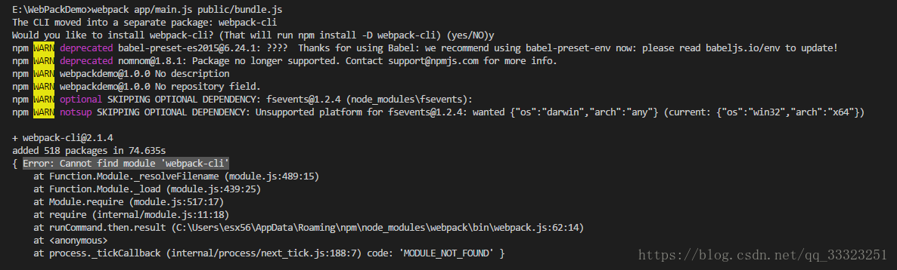

# Webpack概念

*webpack* 是一个现代 JavaScript 应用程序的*静态模块打包器*(module bundler)。当 webpack 处理应用程序时，它会**递归**地构建一个**依赖关系图**(dependency graph)，其中包含应用程序需要的每个模块，然后将所有这些模块打包成一个或多个 *bundle*。  

 


# 安装Webpack

在安装Webpack之前，本地环境需要支持Node.js。

### （1）全局安装

- 由于npm安装速度慢，推荐使用淘宝镜像cnpm

~~~shell
$ npm install -g cnpm --registry=https://registry.npm.taobao.org
$ npm config set registry https://registry.npm.taobao.org
~~~


- 使用cnpm安装Webpack

~~~shell
#全局安装webpack（推荐）
cnpm install webpack -g

#如果你使用 webpack 4+ 版本,还需要全局安装CLI
npm install webpack-cli -g


#安装最新版本或特定版本
npm install --save-dev webpack
npm install --save-dev webpack@<version>
~~~


- 查看webpack版本

~~~shell
webpack -v
webpack-cli -v
~~~


### （2）本地安装

~~~shell
#全局安装webpack
npm install webpack --save-dev

#项目初始化
npm init -y
~~~


### （3）最新体验版本

如果你热衷于使用最新版本的 webpack，你可以使用以下命令，直接从 webpack 的仓库中安装： 

~~~shell
npm install webpack@beta
npm install webpack/webpack#<tagname/branchname>
~~~

安装这些最新体验版本时要小心！它们可能仍然包含 bug，因此不应该用于生产环境。 


### （4）错误解决

**Error: Cannot find module 'webpack-cli'**



解决方案：全局安装webpack-cli

~~~shell
npm install webpack-cli -g
~~~


# Webpack打包第一个项目

- 新建一个项目文件夹app，

~~~java
mkdir app   //创建文件夹
cd app      //进入目录
npm init -y //项目初始化
~~~

- 在app文件夹下创建一个**src**目录，并创建一个**src/bar.js**，填入以下代码：

~~~javascript
export default function bar() {
  //
}
~~~

- 创建一个**src/index.js**文件，并填入以下代码

~~~javascript
import bar from './bar';

bar();
~~~

- 创建一个**app/webpack.config.js**文件，写入配置

~~~javascript
const path = require('path');

module.exports = {
  entry: './src/index.js',  //入口
  output: { //出口
    path: path.resolve(__dirname, 'dist'), //路径
    filename: 'bundle.js' //文件名
  }
};
~~~

- 创建一个**app/page.html**文件

~~~html
<!doctype html>
<html>
  <head>
    <title>webpack</title>
  </head>
  <body>
    hello webpack
    <script src="dist/bundle.js"></script>
  </body>
</html>
~~~

- 项目目录结构

~~~shell
- src
	- bar.js
	- index.js
- page.html
- webpack.config.js
- package.json

~~~

- 在命令行输入**webpack**完成打包，
  - 输入webpack --mode development解决警告
  - 或者在config配置文件中添加mode: 'development/production'


# Webpack项目配置文件解析

### （1）入口(entry)

**入口起点(entry point)**指示 webpack 应该使用哪个模块，来作为构建其内部***依赖图***的开始。进入入口起点后，webpack 会找出有哪些模块和库是入口起点（直接和间接）依赖的。

每个依赖项随即被处理，最后输出到称之为 *bundles* 的文件中。可以通过在 webpack 配置中配置 `entry` 属性，来指定一个入口起点（或多个入口起点）。默认值为 `./src`。 

~~~javascript
module.exports = {
  	entry: './path/to/my/entry/file.js'
};
~~~

 

### （2）输出(output)

**output** 属性告诉 webpack **在哪里输出path**它所创建的 *bundles*，以及**如何命名filename**这些文件，默认值为 `./dist`。基本上，整个应用程序结构，都会被编译到你指定的输出路径的文件夹中。你可以通过在配置中指定一个 `output` 字段，来配置这些处理过程： 

~~~javascript
const path = require('path');

module.exports = {
  entry: './path/to/my/entry/file.js',
  output: {
    path: path.resolve(__dirname, 'dist'),
    filename: 'my-first-webpack.bundle.js'
  }
};
~~~

在上面的示例中，通过 `output.filename` 和 `output.path` 属性，来告诉 webpack bundle 的名称，以及我们想要 bundle 生成(emit)到哪里。 

上面导入的path 模块是一个 **Node.js 核心模块**，用于操作文件路径。 


### （3）loader

*loader* 让 webpack 能够去处理那些非 JavaScript 文件（webpack 自身只理解 JavaScript）。loader 可以将所有类型的文件转换为 webpack 能够处理的有效模块，然后你就可以利用 webpack 的打包能力，对它们进行处理。本质上，webpack loader **将所有类型的文件，转换为应用程序的依赖图**（和最终的 bundle）可以直接引用的模块。

loader 能够 `import` 导入任何类型的模块（例如 `.css` 文件），这是 webpack 特有的功能，其他打包程序或任务执行器的可能并不支持。我们认为这种语言扩展是有很必要的，因为这可以使开发人员创建出更准确的依赖关系图。 

~~~JavaScript
const path = require('path');

const config = {
     entry: './path/to/my/entry/file.js',
     output: {
         path： './dist',
         filename: 'my-first-webpack.bundle.js'
     },
     module: {
        rules: [
          	{test: /\.txt$/, use: 'raw-loader' },
            {test: /\.css$/, use: ['style-loader', 'css-loader']}
        ]
     }
};

module.exports = config;
~~~

以上配置表示当webpack 编译器碰到在 `require()`/`import` 语句中被解析为 '.txt' 的路径时，在对它打包之前，先**使用** `raw-loader` 转换一下。


### （4）插件(plugins)

loader 被用于转换某些类型的模块，而插件则可以用于执行范围更广的任务。插件的范围包括，从打包优化和压缩，一直到重新定义环境中的变量。插件接口功能极其强大，可以用来处理各种各样的任务。 

想要使用一个插件，你只需要 `require()` 它，然后把它添加到 `plugins` 数组中。多数插件可以通过选项(option)自定义。你也可以在一个配置文件中因为不同目的而多次使用同一个插件，这时需要通过使用 `new` 操作符来创建它的一个实例 

~~~JavaScript
const HtmlWebpackPlugin = require('html-webpack-plugin'); // 通过 npm 安装
const webpack = require('webpack'); // 用于访问内置插件

const config = {
      module: {
        rules: [
          { test: /\.txt$/, use: 'raw-loader' }
        ]
      },
      plugins: [
        new webpack.optimize.UglifyJsPlugin(),
        new HtmlWebpackPlugin({template: './src/index.html'})
      ]
};

module.exports = config;
~~~


# 起步

## 基本安装

首先我们创建一个目录，初始化 npm，然后 [在本地安装 webpack](https://www.webpackjs.com/guides/installation#local-installation)，接着安装 webpack-cli（此工具用于在命令行中运行 webpack）：

```
mkdir webpack-demo && cd webpack-demo
npm init -y
npm install webpack webpack-cli --save-dev
```

现在我们将创建以下目录结构、文件和内容：

**project**

```
  webpack-demo
  |- package.json
+ |- index.html
+ |- /src
+   |- index.js
```

**src/index.js**

```javascript
function component() {
  var element = document.createElement('div');

  // Lodash（目前通过一个 script 脚本引入）对于执行这一行是必需的
  element.innerHTML = _.join(['Hello', 'webpack'], ' ');

  return element;
}

document.body.appendChild(component());
```

**index.html**

```html
<!doctype html>
<html>
  <head>
    <title>起步</title>
    <script src="https://unpkg.com/lodash@4.16.6"></script>
  </head>
  <body>
    <script src="./src/index.js"></script>
  </body>
</html>
```

我们还需要调整 `package.json` 文件，以便确保我们安装包是`私有的(private)`，并且移除 `main` 入口。这可以防止意外发布你的代码。


**package.json**

```json
  {
    "name": "webpack-demo",
    "version": "1.0.0",
    "description": "",
+   "private": true,
-   "main": "index.js",
    "scripts": {
      "test": "echo \"Error: no test specified\" && exit 1"
    },
    "keywords": [],
    "author": "",
    "license": "ISC",
    "devDependencies": {
      "webpack": "^4.0.1",
      "webpack-cli": "^2.0.9"
    },
    "dependencies": {}
  }
```

在此示例中，`<script>` 标签之间存在隐式依赖关系。`index.js` 文件执行之前，还依赖于页面中引入的 `lodash`。之所以说是隐式的是因为 `index.js` 并未显式声明需要引入 `lodash`，只是假定推测已经存在一个全局变量 `_`。

使用这种方式去管理 JavaScript 项目会有一些问题：

- 无法立即体现，脚本的执行依赖于外部扩展库(external library)。
- 如果依赖不存在，或者引入顺序错误，应用程序将无法正常运行。
- 如果依赖被引入但是并没有使用，浏览器将被迫下载无用代码。

让我们使用 webpack 来管理这些脚本。


## 创建一个 bundle 文件

首先，我们稍微调整下目录结构，将“源”代码(`/src`)从我们的“分发”代码(`/dist`)中分离出来。“源”代码是用于书写和编辑的代码。“分发”代码是构建过程产生的代码最小化和优化后的“输出”目录，最终将在浏览器中加载：

**project**

```javascript
  webpack-demo
  |- package.json
+ |- /dist
+   |- index.html
- |- index.html
  |- /src
    |- index.js
```

要在 `index.js` 中打包 `lodash` 依赖，我们需要在本地安装 library：

```shell
npm install --save lodash
```

现在，在我们的脚本中 import `lodash`：

**src/index.js**

```javascript
+ import _ from 'lodash';
+
  function component() {
    var element = document.createElement('div');

-   // Lodash, currently included via a script, is required for this line to work
+   // Lodash, now imported by this script
    element.innerHTML = _.join(['Hello', 'webpack'], ' ');

    return element;
  }

  document.body.appendChild(component());
```

现在，由于通过打包来合成脚本，我们必须更新 `index.html` 文件。因为现在是通过 `import` 引入 lodash，所以将 lodash `<script>` 删除，然后修改另一个 `<script>` 标签来加载 bundle，而不是原始的 `/src` 文件：

**dist/index.html**

```html
  <!doctype html>
  <html>
   <head>
     <title>起步</title>
-    <script src="https://unpkg.com/lodash@4.16.6"></script>
   </head>
   <body>
-    <script src="./src/index.js"></script>
+    <script src="main.js"></script>
   </body>
  </html>
```

在这个设置中，`index.js` 显式要求引入的 `lodash` 必须存在，然后将它绑定为 `_`（没有全局作用域污染）。通过声明模块所需的依赖，webpack 能够利用这些信息去构建依赖图，然后使用图生成一个**优化过的**，**会以正确顺序执行**的 bundle。

可以这样说，执行 `npx webpack`，会将我们的脚本作为[入口起点](https://www.webpackjs.com/concepts/entry-points)，然后 [输出](https://www.webpackjs.com/concepts/output) 为 `main.js`。Node 8.2+ 版本提供的 `npx` 命令，可以运行在初始安装的 webpack 包(package)的 webpack 二进制文件（`./node_modules/.bin/webpack`）：

```
npx webpack

Hash: dabab1bac2b940c1462b
Version: webpack 4.0.1
Time: 3003ms
Built at: 2018-2-26 22:42:11
    Asset      Size  Chunks             Chunk Names
main.js  69.6 KiB       0  [emitted]  main
Entrypoint main = main.js
   [1] (webpack)/buildin/module.js 519 bytes {0} [built]
   [2] (webpack)/buildin/global.js 509 bytes {0} [built]
   [3] ./src/index.js 256 bytes {0} [built]
    + 1 hidden module

WARNING in configuration(配置警告)
The 'mode' option has not been set. Set 'mode' option to 'development' or 'production' to enable defaults for this environment.('mode' 选项还未设置。将 'mode' 选项设置为 'development' 或 'production'，来启用环境默认值。)
```

> 输出可能会稍有不同，但是只要构建成功，那么你就可以继续。并且不要担心，稍后我们就会解决。

在浏览器中打开 `index.html`，如果一切访问都正常，你应该能看到以下文本：'Hello webpack'。


## 使用一个配置文件

在 webpack 4 中，可以无须任何配置使用，然而大多数项目会需要很复杂的设置，这就是为什么 webpack 仍然要支持 [配置文件](https://www.webpackjs.com/concepts/configuration)。这比在终端(terminal)中手动输入大量命令要高效的多，所以让我们创建一个取代以上使用 CLI 选项方式的配置文件：


**project**

```
  webpack-demo
  |- package.json
+ |- webpack.config.js
  |- /dist
    |- index.html
  |- /src
    |- index.js
```

**webpack.config.js**

```javascript
const path = require('path');

module.exports = {
  entry: './src/index.js',
  output: {
    filename: 'bundle.js',
    path: path.resolve(__dirname, 'dist')
  }
};
```

现在，让我们通过新配置文件再次执行构建：

```shell
npx webpack --config webpack.config.js

Hash: dabab1bac2b940c1462b
Version: webpack 4.0.1
Time: 328ms
Built at: 2018-2-26 22:47:43
    Asset      Size  Chunks             Chunk Names
bundle.js  69.6 KiB       0  [emitted]  main
Entrypoint main = bundle.js
   [1] (webpack)/buildin/module.js 519 bytes {0} [built]
   [2] (webpack)/buildin/global.js 509 bytes {0} [built]
   [3] ./src/index.js 256 bytes {0} [built]
    + 1 hidden module

WARNING in configuration(配置警告)
The 'mode' option has not been set. Set 'mode' option to 'development' or 'production' to enable defaults for this environment.('mode' 选项还未设置。将 'mode' 选项设置为 'development' 或 'production'，来启用环境默认值。)
```

> 注意，当在 windows 中通过调用路径去调用 `webpack` 时，必须使用反斜线()。例如 `node_modules\.bin\webpack --config webpack.config.js`。

> 如果 `webpack.config.js` 存在，则 `webpack` 命令将默认选择使用它。我们在这里使用 `--config` 选项只是向你表明，可以传递任何名称的配置文件。这对于需要拆分成多个文件的复杂配置是非常有用。

比起 CLI 这种简单直接的使用方式，配置文件具有更多的灵活性。我们可以通过配置方式指定 loader 规则(loader rules)、插件(plugins)、解析选项(resolve options)，以及许多其他增强功能。


## NPM 脚本(NPM Scripts)

考虑到用 CLI 这种方式来运行本地的 webpack 不是特别方便，我们可以**设置一个快捷方式**。在 *package.json* 添加一个 npm 脚本(npm script)：

**package.json**

```json
  {
    "name": "webpack-demo",
    "version": "1.0.0",
    "description": "",
    "main": "index.js",
    "scripts": {
      "test": "echo \"Error: no test specified\" && exit 1",
+     "build": "webpack"
    },
    "keywords": [],
    "author": "",
    "license": "ISC",
    "devDependencies": {
      "webpack": "^4.0.1",
      "webpack-cli": "^2.0.9",
      "lodash": "^4.17.5"
    }
  }
```

现在，可以使用 `npm run build` 命令，来替代我们之前使用的 `npx` 命令。注意，使用 npm 的 `scripts`，我们可以像使用 `npx` 那样通过模块名引用本地安装的 npm 包。这是大多数基于 npm 的项目遵循的标准，因为它允许所有贡献者使用同一组通用脚本（如果必要，每个 flag 都带有 `--config` 标志）。

现在运行以下命令，然后看看你的脚本别名是否正常运行：

```
npm run build

Hash: dabab1bac2b940c1462b
Version: webpack 4.0.1
Time: 323ms
Built at: 2018-2-26 22:50:25
    Asset      Size  Chunks             Chunk Names
bundle.js  69.6 KiB       0  [emitted]  main
Entrypoint main = bundle.js
   [1] (webpack)/buildin/module.js 519 bytes {0} [built]
   [2] (webpack)/buildin/global.js 509 bytes {0} [built]
   [3] ./src/index.js 256 bytes {0} [built]
    + 1 hidden module

WARNING in configuration(配置警告)
The 'mode' option has not been set. Set 'mode' option to 'development' or 'production' to enable defaults for this environment.('mode' 选项还未设置。将 'mode' 选项设置为 'development' 或 'production'，来启用环境默认值。)
```


例如：

1、在scripts中添加命令

~~~shell
"start": "webpack --config webpack.config.js"
~~~

2、执行 **npm run start** 就可以将项目进行打包


## 构建完成的项目结构

**project**

```
webpack-demo
|- package.json
|- webpack.config.js
|- /dist
  |- bundle.js
  |- index.html
|- /src
  |- index.js
|- /node_modules
```


# 管理资源

## 加载 CSS

为了从 JavaScript 模块中 `import` 一个 CSS 文件，你需要在 [`module` 配置中](https://www.webpackjs.com/configuration/module) 安装并添加 [style-loader](https://www.webpackjs.com/loaders/style-loader) 和 [css-loader](https://www.webpackjs.com/loaders/css-loader)：

```
npm install --save-dev style-loader css-loader
```

**webpack.config.js**

```javascript
  const path = require('path');

  module.exports = {
    entry: './src/index.js',
    output: {
      filename: 'bundle.js',
      path: path.resolve(__dirname, 'dist')
    },
+   module: {
+     rules: [
+       {
+         test: /\.css$/,
+         use: [
+           'style-loader',
+           'css-loader'
+         ]
+       }
+     ]
+   }
  };
```

> webpack 根据正则表达式，来确定应该查找哪些文件，并将其提供给指定的 loader。在这种情况下，以 `.css` 结尾的全部文件，都将被提供给 `style-loader` 和 `css-loader`。

这时你可以在依赖于此样式的文件中 `import './style.css'`。现在，当该模块运行时，含有 CSS 字符串的 `<style>` 标签，将被插入到 html 文件的 `<head>` 中。

我们尝试一下，通过在项目中添加一个新的 `style.css` 文件，并将其导入到我们的 `index.js` 中：

**project**

```
  webpack-demo
  |- package.json
  |- webpack.config.js
  |- /dist
    |- bundle.js
    |- index.html
  |- /src
+   |- style.css
    |- index.js
  |- /node_modules
```

**src/style.css**

```
.hello {
  color: red;
}
```

**src/index.js**

```
  import _ from 'lodash';
+ import './style.css';

  function component() {
    var element = document.createElement('div');

    // lodash 是由当前 script 脚本 import 导入进来的
    element.innerHTML = _.join(['Hello', 'webpack'], ' ');
+   element.classList.add('hello');

    return element;
  }

  document.body.appendChild(component());
```

现在运行构建命令：

```
npm run build

Hash: 9a3abfc96300ef87880f
Version: webpack 2.6.1
Time: 834ms
    Asset    Size  Chunks                    Chunk Names
bundle.js  560 kB       0  [emitted]  [big]  main
   [0] ./~/lodash/lodash.js 540 kB {0} [built]
   [1] ./src/style.css 1 kB {0} [built]
   [2] ./~/css-loader!./src/style.css 191 bytes {0} [built]
   [3] ./~/css-loader/lib/css-base.js 2.26 kB {0} [built]
   [4] ./~/style-loader/lib/addStyles.js 8.7 kB {0} [built]
   [5] ./~/style-loader/lib/urls.js 3.01 kB {0} [built]
   [6] (webpack)/buildin/global.js 509 bytes {0} [built]
   [7] (webpack)/buildin/module.js 517 bytes {0} [built]
   [8] ./src/index.js 351 bytes {0} [built]
```

再次在浏览器中打开 `index.html`，你应该看到 `Hello webpack` 现在的样式是红色。要查看 webpack 做了什么，请检查页面（不要查看页面源代码，因为它不会显示结果），并查看页面的 head 标签。它应该包含我们在 `index.js` 中导入的 style 块元素。

> 请注意，在多数情况下，你也可以进行 [CSS 分离](https://www.webpackjs.com/plugins/extract-text-webpack-plugin)，以便在生产环境中节省加载时间。最重要的是，现有的 loader 可以支持任何你可以想到的 CSS 处理器风格 - [postcss](https://www.webpackjs.com/loaders/postcss-loader), [sass](https://www.webpackjs.com/loaders/sass-loader) 和 [less](https://www.webpackjs.com/loaders/less-loader) 等。


## 加载图片

假想，现在我们正在下载 CSS，但是我们的背景和图标这些图片，要如何处理呢？使用 [file-loader](https://www.webpackjs.com/loaders/file-loader)，我们可以轻松地将这些内容混合到 CSS 中：

```shell
npm install --save-dev file-loader
```

**webpack.config.js**

```javascript
  const path = require('path');

  module.exports = {
    entry: './src/index.js',
    output: {
      filename: 'bundle.js',
      path: path.resolve(__dirname, 'dist')
    },
    module: {
      rules: [
        {
          test: /\.css$/,
          use: [
            'style-loader',
            'css-loader'
          ]
        },
+       {
+         test: /\.(png|svg|jpg|gif)$/,
+         use: [
+           'file-loader'
+         ]
+       }
      ]
    }
  };
```

现在，当你 `import MyImage from './my-image.png'`，该图像将被处理并添加到 `output` 目录，_并且_ `MyImage` 变量将包含该图像在处理后的最终 url。当使用 [css-loader](https://www.webpackjs.com/loaders/css-loader) 时，如上所示，你的 CSS 中的 `url('./my-image.png')` 会使用类似的过程去处理。loader 会识别这是一个本地文件，并将 `'./my-image.png'` 路径，替换为`输出`目录中图像的最终路径。[html-loader](https://www.webpackjs.com/loaders/html-loader) 以相同的方式处理 ``。

我们向项目添加一个图像，然后看它是如何工作的，你可以使用任何你喜欢的图像：

**project**

```
  webpack-demo
  |- package.json
  |- webpack.config.js
  |- /dist
    |- bundle.js
    |- index.html
  |- /src
+   |- icon.png
    |- style.css
    |- index.js
  |- /node_modules
```

**src/index.js**

```javascript
  import _ from 'lodash';
  import './style.css';
+ import Icon from './icon.png';

  function component() {
    var element = document.createElement('div');

    // Lodash，现在由此脚本导入
    element.innerHTML = _.join(['Hello', 'webpack'], ' ');
    element.classList.add('hello');

+   // 将图像添加到我们现有的 div。
+   var myIcon = new Image();
+   myIcon.src = Icon;
+
+   element.appendChild(myIcon);

    return element;
  }

  document.body.appendChild(component());
```

**src/style.css**

```
  .hello {
    color: red;
+   background: url('./icon.png');
  }
```

让我们重新构建，并再次打开 index.html 文件：

```
npm run build

Hash: 854865050ea3c1c7f237
Version: webpack 2.6.1
Time: 895ms
                               Asset     Size  Chunks                    Chunk Names
5c999da72346a995e7e2718865d019c8.png  11.3 kB          [emitted]
                           bundle.js   561 kB       0  [emitted]  [big]  main
   [0] ./src/icon.png 82 bytes {0} [built]
   [1] ./~/lodash/lodash.js 540 kB {0} [built]
   [2] ./src/style.css 1 kB {0} [built]
   [3] ./~/css-loader!./src/style.css 242 bytes {0} [built]
   [4] ./~/css-loader/lib/css-base.js 2.26 kB {0} [built]
   [5] ./~/style-loader/lib/addStyles.js 8.7 kB {0} [built]
   [6] ./~/style-loader/lib/urls.js 3.01 kB {0} [built]
   [7] (webpack)/buildin/global.js 509 bytes {0} [built]
   [8] (webpack)/buildin/module.js 517 bytes {0} [built]
   [9] ./src/index.js 503 bytes {0} [built]
```

如果一切顺利，和 `Hello webpack` 文本旁边的 `img` 元素一样，现在看到的图标是重复的背景图片。如果你检查此元素，你将看到实际的文件名已更改为像 `5c999da72346a995e7e2718865d019c8.png` 一样。这意味着 webpack 在 `src` 文件夹中找到我们的文件，并成功处理过它！


## 加载数据

此外，可以加载的有用资源还有数据，如 JSON 文件，CSV、TSV 和 XML。类似于 NodeJS，JSON 支持实际上是内置的，也就是说 `import Data from './data.json'` 默认将正常运行。要导入 CSV、TSV 和 XML，你可以使用 [csv-loader](https://github.com/theplatapi/csv-loader) 和 [xml-loader](https://github.com/gisikw/xml-loader)。让我们处理这三类文件：

```shell
npm install --save-dev xml-loader
```

**webpack.config.js**

```javascript
  const path = require('path');

  module.exports = {
    entry: './src/index.js',
    output: {
      filename: 'bundle.js',
      path: path.resolve(__dirname, 'dist')
    },
    module: {
      rules: [
        {
          test: /\.css$/,
          use: [
            'style-loader',
            'css-loader'
          ]
        },
        {
          test: /\.(png|svg|jpg|gif)$/,
          use: [
            'file-loader'
          ]
        },
+       {
+         test: /\.xml$/,
+         use: [
+           'xml-loader'
+         ]
+       }
      ]
    }
  };
```

给你的项目添加一些数据文件：

**project**

```
  webpack-demo
  |- package.json
  |- webpack.config.js
  |- /dist
    |- bundle.js
    |- index.html
  |- /src
+   |- data.xml
    |- my-font.woff
    |- my-font.woff2
    |- icon.png
    |- style.css
    |- index.js
  |- /node_modules
```

**src/data.xml**

```html
<?xml version="1.0" encoding="UTF-8"?>
<note>
  <to>Mary</to>
  <from>John</from>
  <heading>Reminder</heading>
  <body>Call Cindy on Tuesday</body>
</note>
```

现在，你可以 `import` 这四种类型的数据(JSON, CSV, TSV, XML)中的任何一种，所导入的 `Data` 变量将包含可直接使用的已解析 JSON：

**src/index.js**

```
  import _ from 'lodash';
  import './style.css';
  import Icon from './icon.png';
+ import Data from './data.xml';

  function component() {
    var element = document.createElement('div');

    // Lodash, now imported by this script
    element.innerHTML = _.join(['Hello', 'webpack'], ' ');
    element.classList.add('hello');

    // Add the image to our existing div.
    var myIcon = new Image();
    myIcon.src = Icon;

    element.appendChild(myIcon);

+   console.log(Data);

    return element;
  }

  document.body.appendChild(component());
```

当你打开 `index.html` 并查看开发者工具中的控制台，你应该能够看到你导入的数据被打印在了上面！


## 加载字体

file-loader 和 url-loader 可以接收并加载任何文件，然后将其输出到构建目录。这就是说，我们可以将它们用于任何类型的文件，包括字体。让我们更新 `webpack.config.js` 来处理字体文件： 

**webpack.config.js**

~~~javascript
 const path = require('path');

  module.exports = {
    entry: './src/index.js',
    output: {
      filename: 'bundle.js',
      path: path.resolve(__dirname, 'dist')
    },
    module: {
      rules: [
        {
          test: /\.css$/,
          use: [
            'style-loader',
            'css-loader'
          ]
        },
        {
          test: /\.(png|svg|jpg|gif)$/,
          use: [
            'file-loader'
          ]
        },
+       {
+         test: /\.(woff|woff2|eot|ttf|otf)$/,
+         use: [
+           'file-loader'
+         ]
+       }
      ]
    }
  };
~~~

在项目中添加一些字体文件： 

**project**

~~~
 webpack-demo
  |- package.json
  |- webpack.config.js
  |- /dist
    |- bundle.js
    |- index.html
  |- /src
+   |- my-font.woff
+   |- my-font.woff2
    |- icon.png
    |- style.css
    |- index.js
  |- /node_modules
~~~

通过配置好 loader 并将字体文件放在合适的地方，你可以通过一个 `@font-face` 声明引入。本地的 `url(...)`指令会被 webpack 获取处理，就像它处理图片资源一样： 

**src/style.css**

~~~css
+ @font-face {
+   font-family: 'MyFont';
+   src:  url('./my-font.woff2') format('woff2'),
+         url('./my-font.woff') format('woff');
+   font-weight: 600;
+   font-style: normal;
+ }

  .hello {
    color: red;
+   font-family: 'MyFont';
    background: url('./icon.png');
  }

~~~

现在让我们重新构建（npm run build）来看看 webpack 是否处理了我们的字体。

重新打开 `index.html` 看看我们的 `Hello webpack` 文本显示是否换上了新的字体。如果一切顺利，你应该能看到变化。 


## 全局资源

上述所有内容中最出色之处是，以这种方式加载资源，你可以以更直观的方式将模块和资源组合在一起。无需依赖于含有全部资源的 `/assets` 目录，而是将资源与代码组合在一起。例如，类似这样的结构会非常有用：

```
- |- /assets
+ |– /components
+ |  |– /my-component
+ |  |  |– index.js
+ |  |  |– index.css
+ |  |  |– icon.svg
+ |  |  |– img.png
```

这种配置方式会使你的代码更具备可移植性，因为现有的统一放置的方式会造成所有资源紧密耦合在一起。假如你想在另一个项目中使用 `/my-component`，只需将其复制或移动到 `/components` 目录下。只要你已经安装了任何*扩展依赖(external dependencies)*，并且你*已经在配置中定义过相同的 loader*，那么项目应该能够良好运行。

但是，假如你无法使用新的开发方式，只能被固定于旧有开发方式，或者你有一些在多个组件（视图、模板、模块等）之间共享的资源。你仍然可以将这些资源存储在公共目录(base directory)中，甚至配合使用 [alias](https://www.webpackjs.com/configuration/resolve#resolve-alias) 来使它们更方便 `import 导入`。


# 管理输出

到目前为止，我们在 `index.html` 文件中手动引入所有资源，然而随着应用程序增长，并且一旦开始对[文件名使用哈希(hash)](https://www.webpackjs.com/guides/caching)]并输出[多个 bundle](https://www.webpackjs.com/guides/code-splitting)，手动地对 `index.html` 文件进行管理，一切就会变得困难起来。然而，可以通过一些插件，会使这个过程更容易操控。

 

## 预先准备

首先，让我们调整一下我们的项目：

**project**

```
  webpack-demo
  |- package.json
  |- webpack.config.js
  |- /dist
  |- /src
    |- index.js
+   |- print.js
  |- /node_modules
```

我们在 `src/print.js` 文件中添加一些逻辑：

**src/print.js**

```javascript
export default function printMe() {
  	console.log('I get called from print.js!');
}
```

并且在 `src/index.js` 文件中使用这个函数：

**src/index.js**

```javascript
  import _ from 'lodash';
+ import printMe from './print.js';

  function component() {
    var element = document.createElement('div');
+   var btn = document.createElement('button');

    element.innerHTML = _.join(['Hello', 'webpack'], ' ');

+   btn.innerHTML = 'Click me and check the console!';
+   btn.onclick = printMe;
+
+   element.appendChild(btn);

    return element;
  }

  document.body.appendChild(component());
```

我们还要更新 `dist/index.html` 文件，来为 webpack 分离入口做好准备：

**dist/index.html**

```html
  <!doctype html>
  <html>
    <head>
-     <title>Asset Management</title>
+     <title>Output Management</title>
+     <script src="./print.bundle.js"></script>
    </head>
    <body>
-     <script src="./bundle.js"></script>
+     <script src="./app.bundle.js"></script>
    </body>
  </html>
```

现在调整配置。我们将在 entry 添加 `src/print.js` 作为新的入口起点（`print`），然后修改 output，以便根据入口起点名称动态生成 bundle 名称：

**webpack.config.js**

```javascript
  const path = require('path');

  module.exports = {
-   entry: './src/index.js',
+   entry: {
+     app: './src/index.js',
+     print: './src/print.js'
+   },
    output: {
-     filename: 'bundle.js',
+     filename: '[name]
        bundle.js',
      path: path.resolve(__dirname, 'dist')
    }
  };
```

执行 `npm run build`，然后看到生成如下：

```
Hash: aa305b0f3373c63c9051
Version: webpack 3.0.0
Time: 536ms
          Asset     Size  Chunks                    Chunk Names
  app.bundle.js   545 kB    0, 1  [emitted]  [big]  app
print.bundle.js  2.74 kB       1  [emitted]         print
   [0] ./src/print.js 84 bytes {0} {1} [built]
   [1] ./src/index.js 403 bytes {0} [built]
   [3] (webpack)/buildin/global.js 509 bytes {0} [built]
   [4] (webpack)/buildin/module.js 517 bytes {0} [built]
    + 1 hidden module
```

我们可以看到，webpack 生成 `print.bundle.js` 和 `app.bundle.js` 文件，这也和我们在 `index.html` 文件中指定的文件名称相对应。如果你在浏览器中打开 `index.html`，就可以看到在点击按钮时会发生什么。

但是，如果我们更改了我们的一个入口起点的名称，甚至添加了一个新的名称，会发生什么？生成的包将被重命名在一个构建中，但是我们的`index.html`文件仍然会引用旧的名字。我们用 [`HtmlWebpackPlugin`](https://www.webpackjs.com/plugins/html-webpack-plugin) 来解决这个问题。


## 设定 HtmlWebpackPlugin

首先安装插件，并且调整 `webpack.config.js` 文件：

```shell
npm install --save-dev html-webpack-plugin
```

**webpack.config.js**

```javascript
  const path = require('path');
+ const HtmlWebpackPlugin = require('html-webpack-plugin');

  module.exports = {
    entry: {
      app: './src/index.js',
      print: './src/print.js'
    },
+   plugins: [
+     new HtmlWebpackPlugin({
+       title: 'Output Management'
+     })
+   ],
    output: {
      filename: '[name].bundle.js',
      path: path.resolve(__dirname, 'dist')
    }
  };
```

在我们构建之前，你应该了解，虽然在 `dist/` 文件夹我们已经有 `index.html` 这个文件，然而 `HtmlWebpackPlugin` 还是会默认生成 `index.html` 文件。这就是说，它会用新生成的 `index.html` 文件，把我们的原来的替换。让我们看下在执行 `npm run build` 后会发生什么：

```
Hash: 81f82697c19b5f49aebd
Version: webpack 2.6.1
Time: 854ms
           Asset       Size  Chunks                    Chunk Names
 print.bundle.js     544 kB       0  [emitted]  [big]  print
   app.bundle.js    2.81 kB       1  [emitted]         app
      index.html  249 bytes          [emitted]
   [0] ./~/lodash/lodash.js 540 kB {0} [built]
   [1] (webpack)/buildin/global.js 509 bytes {0} [built]
   [2] (webpack)/buildin/module.js 517 bytes {0} [built]
   [3] ./src/index.js 172 bytes {1} [built]
   [4] multi lodash 28 bytes {0} [built]
Child html-webpack-plugin for "index.html":
       [0] ./~/lodash/lodash.js 540 kB {0} [built]
       [1] ./~/html-webpack-plugin/lib/loader.js!./~/html-webpack-plugin/default_index.ejs 538 bytes {0} [built]
       [2] (webpack)/buildin/global.js 509 bytes {0} [built]
       [3] (webpack)/buildin/module.js 517 bytes {0} [built]
```

如果你在代码编辑器中将 `index.html` 打开，你就会看到 `HtmlWebpackPlugin` 创建了一个全新的文件，所有的 bundle 会自动添加到 html 中。


## 清理 `/dist` 文件夹

你可能已经注意到，由于过去的指南和代码示例遗留下来，导致我们的 `/dist` 文件夹相当杂乱。webpack 会生成文件，然后将这些文件放置在 `/dist` 文件夹中，但是 webpack 无法追踪到哪些文件是实际在项目中用到的。

通常，在每次构建前清理 `/dist` 文件夹，是比较推荐的做法，因此只会生成用到的文件。让我们完成这个需求。

[`clean-webpack-plugin`](https://www.npmjs.com/package/clean-webpack-plugin) 是一个比较普及的管理插件，让我们安装和配置下。

```shell
npm install clean-webpack-plugin --save-dev
```

**webpack.config.js**

```javascript
  const path = require('path');
  const HtmlWebpackPlugin = require('html-webpack-plugin');
+ const {CleanWebpackPlugin} = require('clean-webpack-plugin');

  module.exports = {
    entry: {
      app: './src/index.js',
      print: './src/print.js'
    },
    plugins: [
+     new CleanWebpackPlugin(),
      new HtmlWebpackPlugin({
        title: 'Output Management'
      })
    ],
    output: {
      filename: '[name].bundle.js',
      path: path.resolve(__dirname, 'dist')
    }
  };
```

现在执行 `npm run build`，再检查 `/dist` 文件夹。如果一切顺利，你现在应该不会再看到旧的文件，只有构建后生成的文件！


# 开发

## 使用 source map 

当 webpack 打包源代码时，可能会很难追踪到错误和警告在源代码中的原始位置。例如，如果将三个源文件（`a.js`, `b.js` 和 `c.js`）打包到一个 bundle（`bundle.js`）中，而其中一个源文件包含一个错误，那么堆栈跟踪就会简单地指向到 `bundle.js`。这并通常没有太多帮助，因为你可能需要准确地知道错误来自于哪个源文件。

为了更容易地追踪错误和警告，JavaScript 提供了 [source map](http://blog.teamtreehouse.com/introduction-source-maps) 功能，将编译后的代码映射回原始源代码。如果一个错误来自于 `b.js`，source map 就会明确的告诉你。

source map 有很多[不同的选项](https://webpack.docschina.org/configuration/devtool)可用，请务必仔细阅读它们，以便可以根据需要进行配置。

对于本指南，我们使用 `inline-source-map` 选项，这有助于解释说明我们的目的（仅解释说明，不要用于生产环境）：

**webpack.config.js**

```javascript
  const path = require('path');
  const HtmlWebpackPlugin = require('html-webpack-plugin');
  const CleanWebpackPlugin = require('clean-webpack-plugin');

  module.exports = {
    entry: {
      app: './src/index.js',
      print: './src/print.js'
    },
+   devtool: 'inline-source-map',
    plugins: [
      new CleanWebpackPlugin(['dist']),
      new HtmlWebpackPlugin({
        title: 'Development'
      })
    ],
    output: {
      filename: '[name].bundle.js',
      path: path.resolve(__dirname, 'dist')
    }
  };
```

现在，让我们来做一些调试，在 `print.js` 文件中生成一个错误：

**src/print.js**

```javascript
  export default function printMe() {
-   console.log('I get called from print.js!');
+   cosnole.error('I get called from print.js!');
  }
```

运行 `npm run build`，就会编译为如下：

```
Hash: 7bf68ca15f1f2690e2d1
Version: webpack 3.1.0
Time: 1224ms
          Asset       Size  Chunks                    Chunk Names
  app.bundle.js    1.44 MB    0, 1  [emitted]  [big]  app
print.bundle.js    6.43 kB       1  [emitted]         print
     index.html  248 bytes          [emitted]
   [0] ./src/print.js 84 bytes {0} {1} [built]
   [1] ./src/index.js 403 bytes {0} [built]
   [3] (webpack)/buildin/global.js 509 bytes {0} [built]
   [4] (webpack)/buildin/module.js 517 bytes {0} [built]
    + 1 hidden module
Child html-webpack-plugin for "index.html":
       [2] (webpack)/buildin/global.js 509 bytes {0} [built]
       [3] (webpack)/buildin/module.js 517 bytes {0} [built]
        + 2 hidden modules
```

现在在浏览器打开最终生成的 `index.html` 文件，点击按钮，并且在控制台查看显示的错误。错误应该如下：

```
 Uncaught ReferenceError: cosnole is not defined
    at HTMLButtonElement.printMe (print.js:2)
```

我们可以看到，此错误包含有发生错误的文件（`print.js`）和行号（2）的引用。这是非常有帮助的，因为现在我们知道了，所要解决的问题的确切位置。


## 使用观察模式 

你可以指示 webpack "watch" 依赖图中的所有文件以进行更改。如果其中一个文件被更新，代码将被重新编译，所以你不必手动运行整个构建。

我们添加一个用于启动 webpack 的观察模式的 npm script 脚本：

**package.json**

```
  {
    "name": "development",
    "version": "1.0.0",
    "description": "",
    "main": "webpack.config.js",
    "scripts": {
      "test": "echo \"Error: no test specified\" && exit 1",
+     "watch": "webpack --watch",
      "build": "webpack"
    },
    "keywords": [],
    "author": "",
    "license": "ISC",
    "devDependencies": {
      "clean-webpack-plugin": "^0.1.16",
      "css-loader": "^0.28.4",
      "csv-loader": "^2.1.1",
      "file-loader": "^0.11.2",
      "html-webpack-plugin": "^2.29.0",
      "style-loader": "^0.18.2",
      "webpack": "^3.0.0",
      "xml-loader": "^1.2.1"
    }
  }
```

现在，你可以在命令行中运行 `npm run watch`，然后就会看到 webpack 是如何编译代码。 然而，你会发现并没有退出命令行。这是因为 script 脚本当前还在观察文件。

现在，webpack 观察文件的同时，我们先移除我们之前引入的错误：

**src/print.js**

```
  export default function printMe() {
-   cosnole.log('I get called from print.js!');
+   console.log('I get called from print.js!');
  }
```

现在,保存文件并检查终端窗口。应该可以看到 webpack 自动重新编译修改后的模块！

唯一的缺点是，为了看到修改后的实际效果，你需要刷新浏览器。如果能够自动刷新浏览器就更好了，可以尝试使用 `webpack-dev-server`，恰好可以实现我们想要的功能。


## 使用 webpack-dev-server 

`webpack-dev-server` 为你提供了一个简单的 web 服务器，并且能够**实时重新加载**(live reloading)。让我们设置以下：

```shell
npm install --save-dev webpack-dev-server
```

修改配置文件，告诉开发服务器(dev server)，在哪里查找文件：

**webpack.config.js**

```javascript
  const path = require('path');
  const HtmlWebpackPlugin = require('html-webpack-plugin');
  const CleanWebpackPlugin = require('clean-webpack-plugin');

  module.exports = {
    entry: {
      app: './src/index.js',
      print: './src/print.js'
    },
    devtool: 'inline-source-map',
+   devServer: {
+     contentBase: './dist'
+   },
    plugins: [
      new CleanWebpackPlugin(['dist']),
      new HtmlWebpackPlugin({
        title: 'Development'
      })
    ],
    output: {
      filename: '[name].bundle.js',
      path: path.resolve(__dirname, 'dist')
    }
  };
```

以上配置告知 `webpack-dev-server`，在 `localhost:8080` 下建立服务，将 `dist` 目录下的文件，作为可访问文件。

让我们添加一个 script 脚本，可以直接运行开发服务器(dev server)：

**package.json**

```
  {
    "name": "development",
    "version": "1.0.0",
    "description": "",
    "main": "webpack.config.js",
    "scripts": {
      "test": "echo \"Error: no test specified\" && exit 1",
      "watch": "webpack --watch",
+     "start": "webpack-dev-server --open",
      "build": "webpack"
    },
    "keywords": [],
    "author": "",
    "license": "ISC",
    "devDependencies": {
      "clean-webpack-plugin": "^0.1.16",
      "css-loader": "^0.28.4",
      "csv-loader": "^2.1.1",
      "file-loader": "^0.11.2",
      "html-webpack-plugin": "^2.29.0",
      "style-loader": "^0.18.2",
      "webpack": "^3.0.0",
      "xml-loader": "^1.2.1"
    }
  }
```

现在，我们可以在命令行中运行 `npm start`，就会看到浏览器自动加载页面。如果现在修改和保存任意源文件，web 服务器就会自动重新加载编译后的代码。试一下！

`webpack-dev-server` 带有许多可配置的选项。转到[相关文档](https://webpack.docschina.org/configuration/dev-server)以了解更多。

> 现在，服务器正在运行，你可能需要尝试[模块热替换(Hot Module Replacement)](https://webpack.docschina.org/guides/hot-module-replacement)！


## 使用 webpack-dev-middleware 

`webpack-dev-middleware` 是一个容器(wrapper)，它可以把 webpack 处理后的文件传递给一个服务器(server)。 `webpack-dev-server` 在内部使用了它，同时，它也可以作为一个单独的包来使用，以便进行更多自定义设置来实现更多的需求。接下来是一个 webpack-dev-middleware 配合 express server 的示例。

首先，安装 `express` 和 `webpack-dev-middleware`：

```
npm install --save-dev express webpack-dev-middleware
```

接下来我们需要对 webpack 的配置文件做一些调整，以确保中间件(middleware)功能能够正确启用：

**webpack.config.js**

```javascript
  const path = require('path');
  const HtmlWebpackPlugin = require('html-webpack-plugin');
  const CleanWebpackPlugin = require('clean-webpack-plugin');

  module.exports = {
    entry: {
      app: './src/index.js',
      print: './src/print.js'
    },
    devtool: 'inline-source-map',
    plugins: [
      new CleanWebpackPlugin(['dist']),
      new HtmlWebpackPlugin({
        title: 'Output Management'
      })
    ],
    output: {
      filename: '[name].bundle.js',
      path: path.resolve(__dirname, 'dist'),
+     publicPath: '/'
    }
  };
```

`publicPath` 也会在服务器脚本用到，以确保文件资源能够在 `http://localhost:3000` 下正确访问，我们稍后再设置端口号。下一步就是设置我们自定义的 `express` 服务：

**project**

```
  webpack-demo
  |- package.json
  |- webpack.config.js
+ |- server.js
  |- /dist
  |- /src
    |- index.js
    |- print.js
  |- /node_modules
```

**server.js**

```javascript
const express = require('express');
const webpack = require('webpack');
const webpackDevMiddleware = require('webpack-dev-middleware');

const app = express();
const config = require('./webpack.config.js');
const compiler = webpack(config);

// Tell express to use the webpack-dev-middleware and use the webpack.config.js
// configuration file as a base.
app.use(webpackDevMiddleware(compiler, {
  publicPath: config.output.publicPath
}));

// Serve the files on port 3000.
app.listen(3000, function () {
  console.log('Example app listening on port 3000!\n');
});
```

现在，添加一个 npm script，以使我们更方便地运行服务：

**package.json**

```json
  {
    "name": "development",
    "version": "1.0.0",
    "description": "",
    "main": "webpack.config.js",
    "scripts": {
      "test": "echo \"Error: no test specified\" && exit 1",
      "watch": "webpack --watch",
      "start": "webpack-dev-server --open",
+     "server": "node server.js",
      "build": "webpack"
    },
    "keywords": [],
    "author": "",
    "license": "ISC",
    "devDependencies": {
      "clean-webpack-plugin": "^0.1.16",
      "css-loader": "^0.28.4",
      "csv-loader": "^2.1.1",
      "express": "^4.15.3",
      "file-loader": "^0.11.2",
      "html-webpack-plugin": "^2.29.0",
      "style-loader": "^0.18.2",
      "webpack": "^3.0.0",
      "webpack-dev-middleware": "^1.12.0",
      "xml-loader": "^1.2.1"
    }
  }
```

现在，在你的终端执行 `npm run server`，将会有类似如下信息输出：

```
Example app listening on port 3000!
webpack built 27b137af6d9d8668c373 in 1198ms
Hash: 27b137af6d9d8668c373
Version: webpack 3.0.0
Time: 1198ms
          Asset       Size  Chunks                    Chunk Names
  app.bundle.js    1.44 MB    0, 1  [emitted]  [big]  app
print.bundle.js    6.57 kB       1  [emitted]         print
     index.html  306 bytes          [emitted]
   [0] ./src/print.js 116 bytes {0} {1} [built]
   [1] ./src/index.js 403 bytes {0} [built]
   [2] ./node_modules/lodash/lodash.js 540 kB {0} [built]
   [3] (webpack)/buildin/global.js 509 bytes {0} [built]
   [4] (webpack)/buildin/module.js 517 bytes {0} [built]
Child html-webpack-plugin for "index.html":
         Asset    Size  Chunks  Chunk Names
    index.html  544 kB       0
       [0] ./node_modules/html-webpack-plugin/lib/loader.js!./node_modules/html-webpack-plugin/default_index.ejs 538 bytes {0} [built]
       [1] ./node_modules/lodash/lodash.js 540 kB {0} [built]
       [2] (webpack)/buildin/global.js 509 bytes {0} [built]
       [3] (webpack)/buildin/module.js 517 bytes {0} [built]
webpack: Compiled successfully.
```

现在，打开浏览器，跳转到 `http://localhost:3000`，你应该看到你的webpack 应用程序已经运行！


# 模块热替换（hot module replacement）

 模块热替换(HMR - Hot Module Replacement)功能会在应用程序运行过程中**替换、添加或删除模块**，而无需重新加载整个页面。主要是通过以下几种方式，来显著加快开发速度：

- 保留在完全重新加载页面时丢失的应用程序状态。
- 只更新变更内容，以节省宝贵的开发时间。
- 调整样式更加快速 - 几乎相当于在浏览器调试器中更改样式。


## 启用 HMR 

启用此功能实际上相当简单。而我们要做的，就是更新 [webpack-dev-server](https://github.com/webpack/webpack-dev-server) 的配置，和使用 webpack 内置的 HMR 插件。我们还要删除掉 `print.js` 的入口起点，因为它现在正被 `index.js` 模式使用。

**webpack.config.js**

```
  const path = require('path');
  const HtmlWebpackPlugin = require('html-webpack-plugin');
  const CleanWebpackPlugin = require('clean-webpack-plugin');
+ const webpack = require('webpack');

  module.exports = {
    entry: {
-      app: './src/index.js',
-      print: './src/print.js'
+      app: './src/index.js'
    },
    devtool: 'inline-source-map',
    devServer: {
      contentBase: './dist',
+     hot: true
    },
    plugins: [
      new CleanWebpackPlugin(['dist']),
      new HtmlWebpackPlugin({
        title: 'Hot Module Replacement'
      }),
+     new webpack.HotModuleReplacementPlugin()
    ],
    output: {
      filename: '[name].bundle.js',
      path: path.resolve(__dirname, 'dist')
    }
  };
```

> 你可以通过命令来修改 [webpack-dev-server](https://github.com/webpack/webpack-dev-server) 的配置：`webpack-dev-server --hotOnly`。

现在，我们来修改 `index.js` 文件，以便当 `print.js` 内部发生变更时可以告诉 webpack 接受更新的模块。

**index.js**

```
  import _ from 'lodash';
  import printMe from './print.js';

  function component() {
    var element = document.createElement('div');
    var btn = document.createElement('button');

    element.innerHTML = _.join(['Hello', 'webpack'], ' ');

    btn.innerHTML = 'Click me and check the console!';
    btn.onclick = printMe;

    element.appendChild(btn);

    return element;
  }

  document.body.appendChild(component());
+
+ if (module.hot) {
+   module.hot.accept('./print.js', function() {
+     console.log('Accepting the updated printMe module!');
+     printMe();
+   })
+ }
```

更改 `print.js` 中 `console.log` 的输出内容，你将会在浏览器中看到如下的输出。

**print.js**

```
  export default function printMe() {
-   console.log('I get called from print.js!');
+   console.log('Updating print.js...')
  }
```

**console**

```
[HMR] Waiting for update signal from WDS...
main.js:4395 [WDS] Hot Module Replacement enabled.
+ 2main.js:4395 [WDS] App updated. Recompiling...
+ main.js:4395 [WDS] App hot update...
+ main.js:4330 [HMR] Checking for updates on the server...
+ main.js:10024 Accepting the updated printMe module!
+ 0.4b8ee77….hot-update.js:10 Updating print.js...
+ main.js:4330 [HMR] Updated modules:
+ main.js:4330 [HMR]  - 20
```


## 通过 Node.js API 

当使用 webpack dev server 和 Node.js API 时，不要将 dev server 选项放在 webpack 配置对象(webpack config object)中。而是，在创建选项时，将其作为第二个参数传递。例如：

`new WebpackDevServer(compiler, options)`

想要启用 HMR，还需要修改 webpack 配置对象，使其包含 HMR 入口起点。`webpack-dev-server` package 中具有一个叫做 `addDevServerEntrypoints` 的方法，你可以通过使用这个方法来实现。这是关于如何使用的一个小例子：

**dev-server.js**

```javascript
const webpackDevServer = require('webpack-dev-server');
const webpack = require('webpack');

const config = require('./webpack.config.js');
const options = {
  contentBase: './dist',
  hot: true,
  host: 'localhost'
};

webpackDevServer.addDevServerEntrypoints(config, options);
const compiler = webpack(config);
const server = new webpackDevServer(compiler, options);

server.listen(5000, 'localhost', () => {
  console.log('dev server listening on port 5000');
});
```


## HMR 修改样式表 

借助于 `style-loader` 的帮助，CSS 的模块热替换实际上是相当简单的。当更新 CSS 依赖模块时，此 loader 在后台使用 `module.hot.accept` 来修补(patch) `<style>` 标签。

所以，可以使用以下命令安装两个 loader ：

```shell
npm install --save-dev style-loader css-loader
```

接下来我们来更新 webpack 的配置，让这两个 loader 生效。

**webpack.config.js**

```javascript
  const path = require('path');
  const HtmlWebpackPlugin = require('html-webpack-plugin');
+ const webpack = require('webpack');

  module.exports = {
    entry: {
      app: './src/index.js'
    },
    devtool: 'inline-source-map',
    devServer: {
      contentBase: './dist',
+     hot: true
    },
+   module: {
+     rules: [
+       {
+         test: /\.css$/,
+         use: ['style-loader', 'css-loader']
+       }
+     ]
+   },
    plugins: [
      new CleanWebpackPlugin(['dist'])
      new HtmlWebpackPlugin({
        title: 'Hot Module Replacement'
      }),
+     new webpack.HotModuleReplacementPlugin()
    ],
    output: {
      filename: '[name].bundle.js',
      path: path.resolve(__dirname, 'dist')
    }
  };
```

热加载样式表，与将其导入模块一样简单：

**project**

```
  webpack-demo
  | - package.json
  | - webpack.config.js
  | - /dist
    | - bundle.js
  | - /src
    | - index.js
    | - print.js
+   | - styles.css
```

**styles.css**

```css
body {
  background: blue;
}
```

**index.js**

```javascript
  import _ from 'lodash';
  import printMe from './print.js';
+ import './styles.css';

  function component() {
    var element = document.createElement('div');
    var btn = document.createElement('button');

    element.innerHTML = _.join(['Hello', 'webpack'], ' ');

    btn.innerHTML = 'Click me and check the console!';
    btn.onclick = printMe;  // onclick event is bind to the original printMe function

    element.appendChild(btn);

    return element;
  }

  let element = component();
  document.body.appendChild(element);

  if (module.hot) {
    module.hot.accept('./print.js', function() {
      console.log('Accepting the updated printMe module!');
      document.body.removeChild(element);
      element = component(); // Re-render the "component" to update the click handler
      document.body.appendChild(element);
    })
  }
```

将 `body` 上的样式修改为 `background: red;`，你应该可以立即看到页面的背景颜色随之更改，而无需完全刷新。

**styles.css**

```css
  body {
-   background: blue;
+   background: red;
  }
```


# 模式(mode)

提供 `mode` 配置选项，告知 webpack 使用相应模式的内置优化。 

- 可以在config配置文件中指定：

```javascript
module.exports = {
  mode: 'production'
};
```


- 可以在 [CLI](https://www.webpackjs.com/api/cli/) 参数中传递： 

```shell
webpack --mode production
webpack --mode development
```